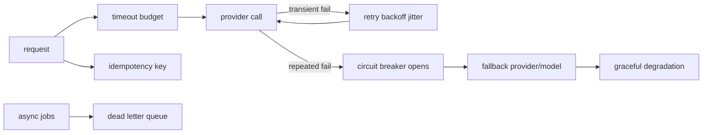

# Reliability Patterns (retries, fallbacks, circuit breakers)

> Topic package — Domain 8 · Roadmap Week 22.
> Depth goal: design LLM applications that survive provider errors, rate limits, slow responses, malformed outputs, tool failures, and partial outages using bounded retries, fallbacks, circuit breakers, queues, and degradation paths.

## Source
- Track: LLM Engineering (self-directed, FDE roadmap)
- Slide deck: `07 Resources Library/LLM Engineering/Slides/Lesson_48_Reliability_Patterns.pptx`
- Hands-on notebook: `07 Resources Library/LLM Engineering/Notebooks/48_Reliability_Patterns.ipynb` (runs offline)
- Reference reading: Resilience engineering patterns; circuit breaker pattern (Nygard); provider rate-limit/status documentation; AWS architecture backoff and jitter guidance; queue/dead-letter reliability patterns
- Builds on: [[02 Literature Notes/LLM Engineering/Structured Generation]] · [[02 Literature Notes/LLM Engineering/Cost Architecture]]
- Date: 2026-07-18

---

## 1. Mental Model

**Reliability is controlling failure blast radius, not pretending failures will stop.** LLM applications depend on remote model providers, vector stores, tools, parsers, and user-specific data. Any of them can be slow, rate-limited, malformed, or unavailable. The architecture must decide what to retry, what to abandon, what to degrade, and when to stop making things worse.

The reliability stack is layered: strict **timeouts** bound waiting; **retries with exponential backoff and jitter** handle transient failures; **fallbacks** switch models/providers or simpler behavior; **circuit breakers** stop hammering unhealthy dependencies; **idempotency** prevents duplicate side effects; **dead-letter queues** preserve failed async work for repair.

> Key intuition: **every LLM call needs an escape plan.** The best systems fail smaller, cheaper, and more honestly.



---

## 2. How It Actually Works

### 8.1 Timeouts and budgets
Every external call needs a deadline shorter than the user's patience and the upstream request timeout. Split the budget across retrieval, model call, tools, and validation. Without timeouts, retries stack up, queues grow, and a partial provider slowdown becomes a system-wide outage.

### 8.2 Retries with exponential backoff and jitter
Retries are for transient failures: 429s, 5xxs, dropped connections, and occasional timeouts. They are not for deterministic validation failures or unsafe requests. Use exponential backoff with jitter to avoid synchronized retry storms, cap attempts, and respect provider `Retry-After` headers.

### 8.3 Fallback models and graceful degradation
Fallbacks can switch provider, region, model size, or product behavior. A support bot might fall back from answer generation to retrieval-only snippets; an agent might disable tool execution and ask the user to retry. Degradation should be explicit in the UX and safe: better a partial answer than a fabricated one.

### 8.4 Circuit breakers and rate-limit handling
Circuit breakers stop sending traffic to a dependency after repeated failures, then probe it later in half-open state. This protects latency, cost, and providers. Rate-limit handling should combine client-side quotas, token buckets, backpressure, and queueing rather than blind retries.

### 8.5 Idempotency and async recovery
If a retry can trigger side effects — sending email, creating tickets, charging accounts, writing memory — require idempotency keys. Async jobs should go through queues with retry counts and dead-letter queues so failures are inspectable and replayable rather than silently lost.

---

## 3. Implementation

Assumed stack: stdlib + numpy — deterministic simulations for retry schedules, fallback routing, circuit breaker states, rate-limit handling, and dead-letter queues. Snippets:
- [[04 Code Snippets/LLM/Retry Backoff With Jitter Simulator]]
- [[04 Code Snippets/LLM/Circuit Breaker State Machine]]

### Retry Backoff With Jitter Simulator
Generate bounded exponential backoff delays without actually sleeping.
```python
import random

def retry_schedule(base=0.2, factor=2.0, cap=3.0, attempts=5, seed=7):
    rng = random.Random(seed)
    delays = []
    for i in range(attempts):
        raw = min(cap, base * (factor ** i))
        jitter = rng.uniform(0, raw * 0.25)
        delays.append(round(raw + jitter, 3))
    return delays

def call_with_retries(outcomes):
    delays = retry_schedule(attempts=len(outcomes))
    for i, ok in enumerate(outcomes):
        if ok: return {"attempt": i+1, "slept_seconds": round(sum(delays[:i]), 3), "status": "ok"}
    return {"attempt": len(outcomes), "slept_seconds": round(sum(delays[:-1]), 3), "status": "failed"}

print(retry_schedule())
print(call_with_retries([False, False, True]))
```

### Circuit Breaker State Machine
Open after repeated failures, block calls, then probe with half-open recovery.
```python
class CircuitBreaker:
    def __init__(self, failure_threshold=3, reset_after=2):
        self.threshold = failure_threshold; self.reset_after = reset_after
        self.failures = 0; self.state = "closed"; self.opened_at = None
    def allow(self, tick):
        if self.state == "open" and tick - self.opened_at >= self.reset_after:
            self.state = "half_open"; return True
        return self.state != "open"
    def record(self, ok, tick):
        if ok:
            self.failures = 0; self.state = "closed"; self.opened_at = None
        else:
            self.failures += 1
            if self.failures >= self.threshold:
                self.state = "open"; self.opened_at = tick

cb = CircuitBreaker()
for tick, ok in enumerate([False, False, False, True, True, False]):
    print(tick, "allow", cb.allow(tick), "state", cb.state)
    if cb.allow(tick): cb.record(ok, tick)
```

---

## 4. Design Decisions & Tradeoffs

| Decision | Guidance |
|---|---|
| **Retry scope** | Retry transient 429/5xx/timeouts; do not retry deterministic schema, policy, or validation failures blindly. |
| **Timeout budget** | Set per-step deadlines inside the overall user-facing SLO; leave room for fallbacks. |
| **Fallback order** | Prefer equivalent provider/model, then smaller model, then retrieval-only or honest degradation. |
| **Circuit threshold** | Open fast enough to protect the system, but probe half-open to recover automatically. |
| **Idempotency** | Require idempotency keys for any retryable side effect or tool action. |
| **Async failures** | Use queues and DLQs for offline work; never drop failed generations silently. |

---

## 5. Failure Modes & Gotchas

- Infinite or unbounded retries → retry storm, higher cost, worse outage.
- No jitter → every client retries at the same time and amplifies rate limits.
- Retrying non-idempotent tool calls → duplicate emails, tickets, charges, or writes.
- No circuit breaker → unhealthy provider consumes all latency budget and threads.
- Fallback silently changes behavior → users trust an answer that came from degraded mode.
- Async jobs fail without DLQ → invisible data loss and no replay path.

---

## 6. FDE Angle

- Reliability patterns convert provider instability into bounded, explainable product behavior.
- A client deliverable should include timeout budgets, retry matrix, fallback tree, and circuit-breaker thresholds.
- Idempotency is especially important for agents because retries can repeat real-world side effects.
- Deliverable: a resilience design that states what fails open, what fails closed, and what degrades.

---

## 7. Self-Check

1. Which failures should be retried, and which should not?
2. Why does jitter matter in retry backoff?
3. What are the closed, open, and half-open circuit breaker states?
4. How do fallbacks differ from graceful degradation?
5. Why do agent tool calls require idempotency keys?
6. What belongs in a dead-letter queue record?

## 8. Links
- Domain MOC: [[06 Maps of Content/LLM Engineering Concepts]]
- Code: [[04 Code Snippets/LLM/Retry Backoff With Jitter Simulator]], [[04 Code Snippets/LLM/Circuit Breaker State Machine]]
- Distilled: [[03 Permanent Notes/Every LLM Call Needs an Escape Plan]], [[03 Permanent Notes/Retries Need Jitter and Idempotency]]
- Upstream: [[02 Literature Notes/LLM Engineering/Cost Architecture]] · Downstream: [[02 Literature Notes/LLM Engineering/LLM Security]]
