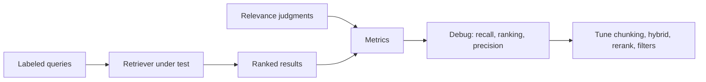

# Retrieval Evaluation (recall@k, MRR, NDCG)

> Topic package — Domain 4 · Roadmap Weeks 14/17.
> Depth goal: build a labeled retrieval evaluation set, compute core IR metrics (recall@k, precision@k, hit rate, MRR, NDCG), and connect them to RAGAS-style context precision/recall.

## Source
- Track: LLM Engineering (self-directed, FDE roadmap)
- Slide deck: `07 Resources Library/LLM Engineering/Slides/Lesson_22_Retrieval_Evaluation.pptx`
- Hands-on notebook: `07 Resources Library/LLM Engineering/Notebooks/22_Retrieval_Evaluation.ipynb` (runs offline)
- Reference reading: TREC evaluation methodology; BEIR benchmark; RAGAS retrieval/context precision and recall metrics; Manning et al. Introduction to Information Retrieval; NDCG literature
- Builds on: [[02 Literature Notes/LLM Engineering/RAG Pipeline Fundamentals]] · [[02 Literature Notes/LLM Engineering/Advanced Retrieval]]
- Date: 2026-07-18

---

## 1. Mental Model

**You cannot debug RAG by reading final answers only; retrieval needs its own test set and metrics.** If the correct evidence never reaches the prompt, no generator prompt can reliably fix the answer. Retrieval evaluation isolates the search component.

The core artifact is a labeled set of queries with relevant document/chunk IDs. Metrics then answer different questions: hit rate asks whether any relevant item appears, recall@k asks how many relevant items are found, precision@k asks how much of the context is useful, MRR rewards early first hits, and NDCG rewards graded relevance near the top.

> Key intuition: **evaluate retrieval like search, then evaluate generation like grounded synthesis.** RAG quality is a product of both.



---

## 2. How It Actually Works

### 4.1 Labeled eval sets
A retrieval eval set contains realistic user queries plus relevant chunk/document IDs. Start with 30-100 high-value questions from logs, SMEs, support tickets, and failure cases. Include negative/ambiguous queries and multi-relevant queries. Keep judgments at the same granularity the retriever returns.

### 4.2 Hit rate, precision, recall
Hit rate@k is 1 if any relevant doc appears in top-k. Precision@k is relevant retrieved / k. Recall@k is relevant retrieved / total relevant. For RAG, recall@k often matters first: the generator cannot cite evidence it never sees. Precision matters because irrelevant context distracts and wastes budget.

### 4.3 MRR and NDCG
MRR measures how early the first relevant result appears: $$MRR=rac{1}{|Q|}\sum_q rac{1}{rank_q}$$. NDCG handles graded relevance and rank positions: highly relevant results near the top are rewarded more than weakly relevant results lower down.

### 4.4 Context precision/recall
RAGAS-style metrics evaluate the assembled context, not just raw retrieval. Context recall asks whether the answer-required facts are present; context precision asks whether retrieved context is mostly useful. These bridge IR metrics and generation faithfulness.

### 4.5 Iterating with metrics
Use metrics diagnostically. Low recall suggests chunking, expansion, hybrid search, or higher candidate k. Low MRR suggests reranking. Low precision suggests filters, reranking, or smaller final k. Always segment by query type, source, tenant, language, and freshness.

---

## 3. Implementation

Assumed stack: stdlib + numpy. Snippets compute IR metrics and run a tiny eval harness. Snippets:
- [[04 Code Snippets/LLM/Retrieval Metrics From Judgments]]
- [[04 Code Snippets/LLM/Labeled Retrieval Eval Harness]]

### Retrieval Metrics From Judgments
Compute hit rate, precision@k, recall@k, MRR, and DCG/NDCG from ranked results.
```python
import math

def metrics(ranked, relevant, k=3):
    top = ranked[:k]
    rel_top = [d for d in top if d in relevant]
    hit = 1.0 if rel_top else 0.0
    precision = len(rel_top) / k
    recall = len(rel_top) / max(1, len(relevant))
    rr = next((1/(i+1) for i,d in enumerate(ranked) if d in relevant), 0.0)
    return {"hit":hit, "precision":precision, "recall":recall, "mrr":rr}

print(metrics(["d2","d1","d3"], {"d1","d4"}, k=3))
```

### Labeled Retrieval Eval Harness
Run a retriever over a small labeled set and aggregate metrics by query.
```python
def evaluate(cases, retriever, k=3):
    totals = {"hit":0, "precision":0, "recall":0, "mrr":0}
    for q, relevant in cases:
        ranked = retriever(q)
        m = metrics(ranked, relevant, k)
        for key in totals: totals[key] += m[key]
        print(q, ranked[:k], m)
    return {key: val/len(cases) for key, val in totals.items()}

cases = [("refund", {"policy"}), ("shipping", {"ship"})]
def toy(q): return ["policy","faq","ship"] if q == "refund" else ["faq","ship","policy"]
print(evaluate(cases, toy, 3))
```

---

## 4. Design Decisions & Tradeoffs

| Decision | Guidance |
|---|---|
| **Judgment granularity** | Label at chunk or document granularity matching retriever output; mismatches distort metrics. |
| **Primary metric** | Use recall@k for evidence availability; use MRR/NDCG for ranking quality; use precision for context noise. |
| **Eval size** | Start small but realistic; grow with production failures and log sampling. |
| **k values** | Report multiple k values: candidate k, rerank k, and final context k. |
| **Segmentation** | Break down by source, language, query type, tenant, and freshness. |
| **Generation link** | Do not infer answer quality from retrieval metrics alone; pair with faithfulness evals. |

---

## 5. Failure Modes & Gotchas

- Using final answer accuracy to debug retrieval without seeing ranked evidence.
- Labeling only one relevant document when several chunks are valid.
- Evaluating on synthetic queries that do not resemble user logs.
- Reporting recall@50 when the prompt only receives top-5.
- Ignoring permissions/freshness filters in the eval harness.
- Optimizing aggregate metrics while one critical query segment regresses.

---

## 6. FDE Angle

- Retrieval eval is the fastest way to make RAG debugging objective.
- A labeled eval set becomes a regression suite for chunking, embeddings, rerankers, and filters.
- Clients understand examples; engineers need metrics. Provide both per-query traces and aggregate scores.
- Deliverable: a repeatable eval harness with fixed queries, judgments, metrics, and failure slices.

---

## 7. Self-Check

1. Define hit rate@k, precision@k, and recall@k.
2. Why is recall@k often the first RAG retrieval metric?
3. What does MRR reward?
4. When is NDCG better than binary recall?
5. How do context precision and context recall connect retrieval to generation?

## 8. Links
- Domain MOC: [[06 Maps of Content/LLM Engineering Concepts]]
- Code: [[04 Code Snippets/LLM/Retrieval Metrics From Judgments]], [[04 Code Snippets/LLM/Labeled Retrieval Eval Harness]]
- Distilled: [[03 Permanent Notes/Retrieval Needs Its Own Evaluation Set]], [[03 Permanent Notes/Recall MRR and Precision Diagnose Different Retrieval Failures]]
- Upstream: [[02 Literature Notes/LLM Engineering/Agentic RAG]] · Downstream: [[02 Literature Notes/LLM Engineering/Vector Database Landscape]]
