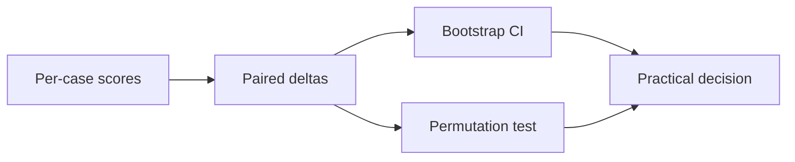

# Statistical Rigor in Eval

> Topic package — Domain 6 · Roadmap Week 17.
> Depth goal: build production-grade LLM evaluation habits: clear datasets, trustworthy metrics, statistical guardrails, and shipping decisions that survive contact with real users.

## Source
- Track: LLM Engineering (self-directed, FDE roadmap)
- Slide deck: `07 Resources Library/LLM Engineering/Slides/Lesson_36_Statistical_Rigor_in_Eval.pptx`
- Hands-on notebook: `07 Resources Library/LLM Engineering/Notebooks/36_Statistical_Rigor_in_Eval.ipynb` (runs offline)
- Reference reading: Efron bootstrap; paired permutation tests; statistics for ML evaluation
- Builds on: [[02 Literature Notes/LLM Engineering/Eval Fundamentals]] · [[02 Literature Notes/LLM Engineering/Retrieval Evaluation]]
- Date: 2026-07-18

---

## 1. Mental Model

**An eval score is an estimate with uncertainty, not a fact carved into stone.** Small datasets, stochastic decoding, correlated examples, and multiple slices can make tiny differences meaningless.

Use paired tests on shared cases, bootstrap intervals for uncertainty, and practical significance thresholds for shipping.

> Key intuition: **do not ship on a decimal point without an uncertainty story.**



---

## 2. How It Actually Works

### 6.1 Sample size
More cases reduce uncertainty, but diversity matters as much as count. Estimate minimum detectable effect and prioritize high-variance slices.

### 6.2 Bootstrap CIs
Bootstrap resamples cases with replacement to approximate uncertainty around means, medians, and slice metrics without strong distribution assumptions.

### 6.3 Paired tests
When systems answer the same examples, compare per-example deltas; paired bootstrap and sign-flip tests remove between-example variance.

### 6.4 Multiple comparisons
If you inspect many slices, some look significant by luck. Correct, confirm on holdout, or treat discoveries as hypotheses.

### 6.5 Generation variance
Temperature, seeds, serving changes, and judge nondeterminism add variance. Use temperature zero or repeated samples and report variance sources.

---

## 3. Implementation

Assumed stack: stdlib + numpy. The snippets are offline and deterministic so they can run in CI before API-backed evaluation. Snippets:
- [[04 Code Snippets/LLM/Bootstrap Confidence Interval]]
- [[04 Code Snippets/LLM/Paired Permutation Test]]

### Bootstrap Confidence Interval
Nonparametric bootstrap CI for an eval metric.
```python
import numpy as np

def bootstrap_ci(x, stat=np.mean, B=5000, alpha=0.05, seed=0):
    rng=np.random.RandomState(seed); x=np.asarray(x,float)
    vals=[stat(rng.choice(x, size=len(x), replace=True)) for _ in range(B)]
    return np.quantile(vals, [alpha/2, 1-alpha/2])
print(bootstrap_ci([1,0,1,1,0,1]))
```

### Paired Permutation Test
Sign-flip permutation test for paired eval deltas.
```python
import numpy as np

def paired_signflip_pvalue(delta, B=10000, seed=0):
    rng=np.random.RandomState(seed); delta=np.asarray(delta,float); obs=abs(delta.mean())
    null=[abs((delta*rng.choice([-1,1], len(delta))).mean()) for _ in range(B)]
    return (np.sum(np.asarray(null)>=obs)+1)/(B+1)
print(paired_signflip_pvalue([0.1,0.0,0.2,-0.1,0.05]))
```

---

## 4. Design Decisions & Tradeoffs

| Decision | Guidance |
|---|---|
| **Dataset boundary** | Write down exactly which population the eval represents and which it excludes. |
| **Metric choice** | Prefer deterministic metrics for mechanical properties; use judges only for semantic qualities that require judgment. |
| **Slicing** | Always inspect business-critical, safety-critical, and historically weak slices. |
| **Calibration** | Compare automated scores against human labels before using them as gates. |
| **Thresholds** | Set pass/block/investigate thresholds before looking at the result. |
| **Artifacts** | Persist inputs, outputs, prompts, model versions, scores, and traces for reproducibility. |

---

## 5. Failure Modes & Gotchas

- Treating a polished demo as evidence of reliability.
- Optimizing a proxy metric after it stops matching user value.
- Reporting only an aggregate score while a critical slice fails.
- Changing prompt, model, data, and scorer at once, making regressions uninterpretable.
- Using a judge without bias audits or human calibration.
- Failing to save per-case artifacts, so failures cannot be debugged.

---

## 6. FDE Angle

- A production eval is a client-facing trust artifact, not internal trivia.
- A clear scorecard lets stakeholders decide whether to ship, hold, or rollback.
- Automated evals reduce manual QA and accelerate iteration.
- Deliverable: versioned dataset, runner, metrics, report, and CI gate.

---

## 7. Self-Check

1. Define the behavior being measured and the evidence required.
2. Explain how the dataset, scorer, baseline, and threshold interact.
3. Name slices that could hide severe regressions behind a good average.
4. Describe how you would calibrate the metric against human judgment.
5. State what artifacts are needed to reproduce a run.
6. Translate a score into a shipping decision.

## 8. Links
- Domain MOC: [[06 Maps of Content/LLM Engineering Concepts]]
- Code: [[04 Code Snippets/LLM/Bootstrap Confidence Interval]], [[04 Code Snippets/LLM/Paired Permutation Test]]
- Distilled: [[03 Permanent Notes/Eval Scores Need Uncertainty Intervals]], [[03 Permanent Notes/Paired Tests Beat Independent Averages for LLM Evals]]
- Upstream: [[02 Literature Notes/LLM Engineering/Eval Fundamentals]] · Downstream: [[02 Literature Notes/LLM Engineering/Statistical Rigor in Eval]]
