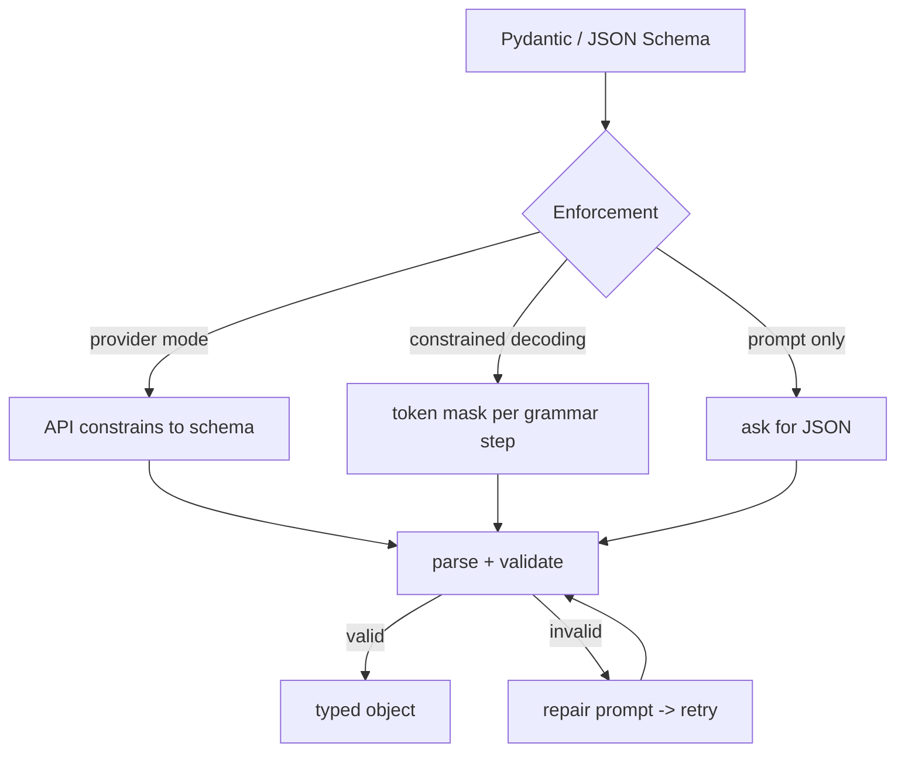

# Structured / Constrained Generation

> Topic package — Domain 2 · Roadmap Weeks 11/15.
> Depth goal: understand JSON mode, function-calling schemas, grammar/constrained decoding, and validate-and-repair loops — enough to guarantee parseable output in production.

## Source
- Track: LLM Engineering (self-directed, FDE roadmap)
- Slide deck: `07 Resources Library/LLM Engineering/Slides/Lesson_10_Structured_Generation.pptx`
- Hands-on notebook: `07 Resources Library/LLM Engineering/Notebooks/10_Structured_Generation.ipynb` (runs offline)
- Reference reading: OpenAI structured outputs / function calling docs; Outlines (Willard & Louf, arXiv:2307.09702); jsonformer; llguidance/guidance; Pydantic docs; BNF grammars in llama.cpp
- Builds on: [[02 Literature Notes/LLM Engineering/Decoding and Sampling]]
- Date: 2026-07-18

---

## 1. Mental Model

**Free-text LLM output is unreliable to parse; structured generation forces the output to conform to a schema so downstream code can trust it.** There are three levels of guarantee, from weakest to strongest:

1. **Prompt-and-pray** — ask for JSON in the prompt, then validate and retry. Works ~90% of the time.
2. **Provider structured mode / function calling** — the API constrains output to your JSON Schema. Strong, easy, but provider-specific.
3. **Constrained decoding** — at each step, mask out any token that would violate the grammar/schema, so *only* valid strings are reachable. 100% valid by construction.

> Key intuition: **don't parse hope — constrain generation.** The reliable pattern is a schema (Pydantic/JSON Schema) + a mechanism to enforce it (provider mode or grammar) + a validate/repair fallback. Structured output is what turns an LLM into an API you can build on.



---

## 2. How It Actually Works

### 2.1 Define the schema first
Start from a typed contract, not a prose description. A Pydantic model *is* a JSON Schema:

```python
from pydantic import BaseModel
class Invoice(BaseModel):
    vendor: str
    total: float
    line_items: list[str]
```

The schema is the single source of truth: it drives the prompt, the provider constraint, and post-hoc validation. This ties structured generation to the **prompt contract** idea.

### 2.2 Provider structured mode & function calling
Modern APIs accept a JSON Schema (`response_format` / tool `parameters`) and *guarantee* the output parses against it (OpenAI "Structured Outputs", tool calls). Under the hood they do constrained decoding. This is the easiest strong guarantee — use it when your provider supports it. Function/tool calling is the same mechanism aimed at 'which function + what arguments'.

### 2.3 Constrained decoding (grammars)
The strongest, provider-agnostic method: convert the schema to a **finite-state machine / grammar**, and at each decode step **set the logits of any token that can't legally come next to −∞**. The model literally cannot produce invalid output. Libraries: Outlines, guidance, jsonformer, llama.cpp GBNF. Cost: some latency + engineering; benefit: 100% structural validity, even from small local models.

### 2.4 Validate-and-repair
Regardless of method, always parse into the typed model and validate (types, ranges, enums, required fields). On failure, **repair**: feed the error back ("your JSON failed: <error>, return corrected JSON") and retry with a bounded number of attempts. This catches semantic errors constraints can't (e.g., total ≠ sum of line items).

### 2.5 Decoding settings for structure
Use **temperature=0**. Randomness only introduces schema-risk and non-determinism with no benefit for extraction/tools. Keep max_tokens generous enough to finish the object (truncation mid-JSON is a common, silent failure).

---

## 3. Implementation

Assumed stack: `pydantic`, plus a validate/repair loop that works with any model. Snippets:
- [[04 Code Snippets/LLM/Validate and Repair Loop for JSON Output]]
- [[04 Code Snippets/LLM/Constrained Decoding with a Token Mask]]

### Validate and Repair Loop for JSON Output
Provider-agnostic: parse into a Pydantic model, repair on failure, bounded retries.
```python
import json
from dataclasses import dataclass

# stand-in for pydantic to keep this runnable anywhere
@dataclass
class Invoice:
    vendor: str
    total: float
    line_items: list

def validate(raw: str) -> Invoice:
    data = json.loads(raw)                     # raises on bad JSON
    assert isinstance(data["vendor"], str)
    assert isinstance(data["total"], (int, float))
    assert isinstance(data["line_items"], list)
    # semantic check a schema can't express:
    assert data["total"] >= 0, "total must be non-negative"
    return Invoice(**data)

def generate_structured(call_model, prompt, max_retries=3):
    err = None
    for attempt in range(max_retries):
        msg = prompt if err is None else (
            f"{prompt}\n\nYour previous output was invalid: {err}\n"
            "Return ONLY corrected JSON.")
        raw = call_model(msg)                  # your LLM call (temperature=0)
        try:
            return validate(raw)
        except Exception as e:
            err = str(e)
    raise ValueError(f"failed after {max_retries} attempts: {err}")
```

### Constrained Decoding with a Token Mask
Toy grammar-constrained decoder: only tokens legal in the current state are sampled.
```python
import numpy as np
# Minimal illustration: generate a boolean JSON value {"ok": true|false}
# States define which token IDs are legal; illegal logits -> -inf.
VOCAB = ['{', '"ok"', ':', 'true', 'false', '}']
TRANSITIONS = {0:[0], 1:[1], 2:[2], 3:[3,4], 4:[5]}  # state -> legal token idxs

def constrained_decode(logits_fn):
    out, state = [], 0
    order = [0,1,2,3,4]              # positions to fill
    for step in order:
        logits = logits_fn(out).astype(float)
        legal = TRANSITIONS[step]
        mask = np.full_like(logits, -np.inf)
        mask[legal] = logits[legal]  # keep only legal tokens
        tok = int(mask.argmax())     # greedy over legal tokens
        out.append(tok)
    return "".join(VOCAB[t] for t in out)

# fake model: prefers 'false' at the value step
def fake_logits(prefix): 
    z = np.zeros(len(VOCAB)); z[4] = 5; z[3] = 3; return z
print(constrained_decode(fake_logits))   # always valid: {"ok":false}
```

---

## 4. Design Decisions & Tradeoffs

| Decision | Guidance |
|---|---|
| **Enforcement level** | Use provider structured mode when available; constrained decoding for local/OSS models or provider-agnostic guarantees; prompt+validate as a floor. |
| **Schema source** | Define once in Pydantic/JSON Schema; reuse for prompt, constraint, and validation. |
| **Temperature** | 0 for structured extraction/tools — no upside to randomness. |
| **Repair retries** | Bounded (2-3). Feed the exact validation error back; give up loudly, don't loop forever. |
| **Semantic vs structural** | Constraints guarantee structure; keep explicit semantic checks (sums, ranges, enums) in code. |
| **max_tokens** | Set high enough to finish the object; mid-JSON truncation is a silent failure. |

---

## 5. Failure Modes & Gotchas

- Parsing free text with regex instead of enforcing a schema → brittle, breaks on the first odd output.
- temperature>0 for extraction → intermittent schema breaks that are hard to reproduce.
- No max_tokens headroom → truncated JSON that 'sometimes' fails.
- Trusting structure to imply correctness → valid JSON with wrong values (need semantic checks).
- Unbounded repair loops → cost blowups; always cap retries.
- Markdown-fenced JSON (```json ... ```) not stripped before json.loads → parse error.

---

## 6. FDE Angle

- Structured output is what turns an LLM demo into an integrable API — this is the enabling skill for the capstone's 'return structured JSON, validate schema'.
- You can promise a client 'the output will always parse' only if you use provider mode or constrained decoding — know the difference.
- The schema is the contract between the AI and the rest of the system; own it in code, version it.
- Deliverable: a generation function that returns a typed object or raises — never a raw string downstream.

---

## 7. Self-Check

1. Name the three levels of structural guarantee and their tradeoffs.
2. How does constrained decoding make invalid output impossible?
3. Why keep semantic validation even with a perfect structural constraint?
4. What decoding temperature for extraction, and why?
5. Design a validate-and-repair loop; when does it give up?

## 8. Links
- Domain MOC: [[06 Maps of Content/LLM Engineering Concepts]]
- Code: [[04 Code Snippets/LLM/Validate and Repair Loop for JSON Output]], [[04 Code Snippets/LLM/Constrained Decoding with a Token Mask]]
- Distilled: [[03 Permanent Notes/Constrain Generation Dont Parse Hope]], [[03 Permanent Notes/Structural Validity Is Not Semantic Correctness]]
- Upstream: [[02 Literature Notes/LLM Engineering/Decoding and Sampling]] · Related: [[02 Literature Notes/LLM Engineering/Prompt Contracts]]
