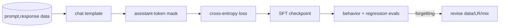

# Supervised Fine-Tuning & Instruction Tuning

> Topic package — Domain 7 · Roadmap Week 18.
> Depth goal: decide when SFT is the right lever, curate prompt-response data, apply chat templates and assistant-only loss masking, and avoid catastrophic forgetting.

## Source
- Track: LLM Engineering (self-directed, FDE roadmap)
- Slide deck: `07 Resources Library/LLM Engineering/Slides/Lesson_39_Supervised_Fine-Tuning.pptx`
- Hands-on notebook: `07 Resources Library/LLM Engineering/Notebooks/39_Supervised_Fine-Tuning.ipynb` (runs offline)
- Reference reading: Ouyang et al. InstructGPT (arXiv:2203.02155); Wei et al. FLAN instruction tuning; Zhou et al. LIMA (arXiv:2305.11206); Hugging Face TRL SFTTrainer docs
- Builds on: [[02 Literature Notes/LLM Engineering/RAG Pipeline Fundamentals]] · [[02 Literature Notes/LLM Engineering/Prompt Contracts]]
- Date: 2026-07-18

---

## 1. Mental Model

**SFT is behavioral cloning for language models: the model learns what a good answer looks like from demonstrations.** It does not reliably install fresh facts; it changes the response policy — tone, format, tool discipline, refusals, and task procedure.

Instruction tuning is broad SFT over many tasks and natural-language commands. The leverage is data quality: clean, representative examples produce more useful behavior than giant noisy dumps.

> Key intuition: **fine-tune behavior, retrieve knowledge** — curate the behavior you want and mask the tokens you do not want to train.



---

## 2. How It Actually Works

### 7.1 The supervised objective
SFT continues next-token training on demonstrations. The target is the assistant response, not the entire chat transcript: $$L=-\sum_{t\in assistant}\log p_\theta(y_t|x,y_{<t})$$. System and user tokens provide context; assistant tokens provide supervision.

### 7.2 Instruction tuning
Instruction tuning is SFT over many natural-language tasks and answer styles. InstructGPT showed the value of demonstrations plus preferences, FLAN showed task-mixture generalization, and LIMA showed that a small set of carefully selected examples can create strong assistant behavior.

### 7.3 Chat templates
A chat template serializes roles into tokens. Training and serving must use the same template, EOS markers, and assistant prefix; otherwise the model learns one interface and is deployed behind another.

### 7.4 Data quality over quantity
Clean, diverse, policy-compliant examples beat large noisy dumps. Remove duplicates, stale answers, boilerplate, hidden chain-of-thought you cannot serve, and examples unlike production traffic.

### 7.5 SFT versus RAG and prompting
Use prompting when the behavior is easy to specify at inference. Use [[02 Literature Notes/LLM Engineering/RAG Pipeline Fundamentals]] when answers need fresh facts or citations. Use SFT when stable repeated behavior or format discipline is the bottleneck.

---

## 3. Implementation

Assumed stack: stdlib + numpy. Snippets cover the core implementation details: chat serialization and assistant-only loss.
- [[04 Code Snippets/LLM/Chat Template and Assistant Loss Mask]]
- [[04 Code Snippets/LLM/Assistant Only Cross Entropy]]

### Chat Template and Assistant Loss Mask
Serialize role messages and mark only assistant tokens as supervised targets.
```python
def render_chat(messages):
    tokens, mask = [], []
    for m in messages:
        text = f"<{m['role']}> " + m['content'].strip() + " <eos>"
        toks = text.split()
        tokens.extend(toks)
        mask.extend([m['role'] == 'assistant'] * len(toks))
    return tokens, mask

msgs = [{'role':'user','content':'Define SFT'}, {'role':'assistant','content':'SFT imitates demonstrations.'}]
print(list(zip(*render_chat(msgs))))
```

### Assistant Only Cross Entropy
Compute loss only on assistant positions.
```python
import numpy as np
def masked_ce(log_probs, labels, mask):
    idx = np.array(mask, dtype=bool)
    return float((-log_probs[np.arange(len(labels))[idx], np.array(labels)[idx]]).mean())
log_probs = np.log(np.array([[.7,.3],[.4,.6],[.2,.8]]))
print(round(masked_ce(log_probs, [0,1,1], [False, True, True]), 3))
```

---

## 4. Design Decisions & Tradeoffs

| Decision | Guidance |
|---|---|
| **SFT vs prompting** | Prompt first; fine-tune only when the same behavioral failure recurs. |
| **SFT vs RAG** | Behavior belongs in weights; changing knowledge and provenance belong in retrieval. |
| **Loss mask** | Mask system/user tokens and train only assistant targets. |
| **Dataset size** | Start with hundreds or thousands of excellent rows before chasing scale. |
| **Forgetting control** | Use low learning rates, early stopping, and regression evals. |
| **Template governance** | Version the chat template with the adapter/checkpoint. |

---

## 5. Failure Modes & Gotchas

- Training on noisy scraped conversations makes the model imitate noise.
- Forgetting prompt-token masking causes role echoing and prompt reconstruction.
- Using SFT as a knowledge upload creates stale untraceable facts.
- Template mismatch between training and inference breaks role behavior.
- Overfitting a tiny style set causes catastrophic forgetting.
- Watching only train loss misses policy, style, and task regressions.

---

## 6. FDE Angle

- Fine-tuning is a product-behavior lever, not a magic memory implant.
- A credible deliverable includes dataset card, train/val split, template, and evals.
- Most SFT incidents trace to data curation, masking, or template drift.
- Choose SFT only after a prompt/RAG baseline proves the gap is behavioral.

---

## 7. Self-Check

1. Which tokens contribute to SFT loss?
2. Why does dataset quality dominate quantity?
3. When is RAG better than SFT?
4. What is a chat-template mismatch?
5. How do you detect catastrophic forgetting?
6. What did InstructGPT, FLAN, and LIMA demonstrate?

## 8. Links
- Domain MOC: [[06 Maps of Content/LLM Engineering Concepts]]
- Code: [[04 Code Snippets/LLM/Chat Template and Assistant Loss Mask]], [[04 Code Snippets/LLM/Assistant Only Cross Entropy]]
- Distilled: [[03 Permanent Notes/SFT Is Behavioral Cloning for Language Models]], [[03 Permanent Notes/Fine Tune Behavior Retrieve Knowledge]]
- Upstream: [[02 Literature Notes/LLM Engineering/Prompt Contracts]] · Downstream: [[02 Literature Notes/LLM Engineering/LoRA QLoRA PEFT]]
