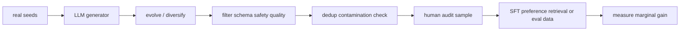

# Synthetic Data Generation

> Topic package — Domain 7 · Roadmap Week 18.
> Depth goal: design synthetic-data pipelines for SFT/eval/retrieval, apply quality filtering and dedup, and manage licensing and contamination risks.

## Source
- Track: LLM Engineering (self-directed, FDE roadmap)
- Slide deck: `07 Resources Library/LLM Engineering/Slides/Lesson_44_Synthetic_Data_Generation.pptx`
- Hands-on notebook: `07 Resources Library/LLM Engineering/Notebooks/44_Synthetic_Data_Generation.ipynb` (runs offline)
- Reference reading: Wang et al. Self-Instruct (arXiv:2212.10560); Evol-Instruct / WizardLM; Alpaca; synthetic data for distillation; data contamination and deduplication literature
- Builds on: [[02 Literature Notes/LLM Engineering/Supervised Fine-Tuning]] · [[02 Literature Notes/LLM Engineering/Evaluating LLMs]]
- Date: 2026-07-18

---

## 1. Mental Model

**Synthetic data is a factory, not free truth.** LLMs can generate examples at scale, but every generated row is only as good as the seed, prompt, teacher, filters, and audit loop.

Self-Instruct creates new tasks and answers; Evol-Instruct makes tasks harder; distillation uses a stronger teacher to label data for a smaller model. The value comes from coverage plus governance.

> Key intuition: **generate broadly, filter ruthlessly, track provenance always.**



---

## 2. How It Actually Works

### 7.1 Synthetic data role
LLMs can generate training prompts, responses, preferences, rationales, negatives, and eval cases. Synthetic data is a multiplier, not a substitute for quality control.

### 7.2 Self-Instruct
Self-Instruct bootstraps instruction data by asking a model to create tasks, filter them, and generate responses. Alpaca popularized this recipe for instruction tuning.

### 7.3 Evol-Instruct
Evol-Instruct mutates simple instructions into harder, more constrained, multi-step tasks. It expands coverage when seed tasks are too shallow.

### 7.4 Filtering and dedup
Filter for validity, safety, licensing, contamination, diversity, and near-duplicates. Synthetic data should be scored and sampled, not blindly appended.

### 7.5 Uses and risks
Synthetic data can support SFT, preference data, retriever pairs, red-team tests, and evals. Risks include model collapse, benchmark contamination, license violations, and amplifying teacher biases.

---

## 3. Implementation

Assumed stack: stdlib + numpy. Snippets implement deterministic filtering/dedup and a contamination check.
- [[04 Code Snippets/LLM/Synthetic Data Filter and Deduper]]
- [[04 Code Snippets/LLM/Synthetic Eval Contamination Check]]

### Synthetic Data Filter and Deduper
Filter rows by quality score and remove normalized duplicates.
```python
rows=[{"prompt":"Summarize X","answer":"A", "score":.9},{"prompt":"summarize x ","answer":"A","score":.8},{"prompt":"","answer":"bad","score":.2}]
seen=set(); kept=[]
for r in rows:
    key=(r["prompt"].strip().lower(), r["answer"].strip().lower())
    if r["score"]>=.7 and key[0] and key not in seen:
        seen.add(key); kept.append(r)
print(kept)
```

### Synthetic Eval Contamination Check
Catch generated training rows that overlap with held-out eval prompts.
```python
train_prompts={"define sft","write refund email","summarize x"}
eval_prompts={"define sft","hard legal question"}
leak=train_prompts & eval_prompts
print("leaks", leak)
assert not ({"write refund email"} & eval_prompts)
```

---

## 4. Design Decisions & Tradeoffs

| Decision | Guidance |
|---|---|
| **Seed quality** | Start from real user/task seeds when possible. |
| **Generator** | Use a teacher whose license and behavior are acceptable. |
| **Filtering** | Apply schema checks, dedup, safety filters, and human audits. |
| **Diversity** | Track coverage by task type, difficulty, domain, and style. |
| **Contamination** | Never train on data derived from held-out eval answers. |
| **Mixing** | Blend synthetic with real data and monitor marginal gains. |

---

## 5. Failure Modes & Gotchas

- Blindly trusting generated labels imports teacher errors.
- Near-duplicate synthetic rows inflate dataset size without coverage.
- Synthetic evals leak into training and destroy measurement.
- Licensing terms forbid derivative training use.
- Generated data is too easy, causing shallow instruction following.
- Repeated self-training amplifies model biases and collapse.

---

## 6. FDE Angle

- Synthetic data is often the fastest way to expand coverage after real seeds expose gaps.
- The real deliverable is a generation-and-filtering pipeline, not a raw dump.
- Data provenance and licensing are product requirements.
- Hold-out eval hygiene matters more when the model can generate benchmark-like data.

---

## 7. Self-Check

1. What did Self-Instruct contribute?
2. How does Evol-Instruct change task coverage?
3. Why is dedup necessary?
4. What is contamination?
5. When use synthetic data for evals?
6. How do licensing constraints affect generated data?

## 8. Links
- Domain MOC: [[06 Maps of Content/LLM Engineering Concepts]]
- Code: [[04 Code Snippets/LLM/Synthetic Data Filter and Deduper]], [[04 Code Snippets/LLM/Synthetic Eval Contamination Check]]
- Distilled: [[03 Permanent Notes/Synthetic Data Is a Factory Not Free Truth]], [[03 Permanent Notes/Synthetic Evaluation Data Must Stay Out of Training]]
- Upstream: [[02 Literature Notes/LLM Engineering/Supervised Fine-Tuning]] · [[02 Literature Notes/LLM Engineering/Distillation and Small Models]]
