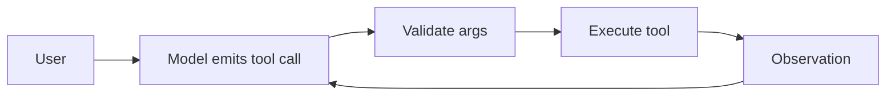

# Tool / Function Calling

> Topic package — Domain 5 · Roadmap Week 16.
> Depth goal: design JSON-schema tool definitions, execute and return tool results, validate arguments, run safe parallel reads, and handle errors.

## Source
- Track: LLM Engineering (self-directed, FDE roadmap)
- Slide deck: `07 Resources Library/LLM Engineering/Slides/Lesson_24_Tool_and_Function_Calling.pptx`
- Hands-on notebook: `07 Resources Library/LLM Engineering/Notebooks/24_Tool_and_Function_Calling.ipynb` (runs offline)
- Reference reading: OpenAI tool/function calling docs; Anthropic tool-use docs; ReAct (Yao 2210.03629); JSON Schema
- Builds on: [[02 Literature Notes/LLM Engineering/Structured Generation]] · [[02 Literature Notes/LLM Engineering/Prompt Contracts]] · [[02 Literature Notes/LLM Engineering/Reasoning Prompt Patterns]]
- Date: 2026-07-18

---

## 1. Mental Model

**Tool calling turns an LLM into a planner that can request typed actions, while your runtime remains the executor and safety boundary.** The model emits structured calls; software validates, authorizes, executes, and returns observations.



---

## 2. How It Actually Works

### 5.1 Tool schemas
Names, descriptions, JSON parameters, required fields, enums, and when-not-to-use notes form a mini API contract.

### 5.2 Execution boundary
The model proposes calls; the runtime validates permissions, budgets, idempotency, and side effects.

### 5.3 Error repair
Return structured errors such as missing fields so the next model step can repair.

### 5.4 Parallel calls
Run independent read-only calls in parallel; serialize writes.

### 5.5 Security
No raw shell, SQL, or broad credentials; use allowlisted adapters and audit logs.

---

## 3. Implementation

Assumed stack: stdlib + numpy where useful. Snippets:
- [[04 Code Snippets/LLM/Validated Function Call Executor]]
- [[04 Code Snippets/LLM/Structured Tool Error Return]]

### Validated Function Call Executor
Validate args before invoking allowlisted tools
```python
def add(a,b): return a+b
TOOLS={"add":({"a":int,"b":int},add)}
def run(call):
    schema,fn=TOOLS[call["name"]]
    args=call["arguments"]
    for k,t in schema.items():
        if not isinstance(args.get(k),t): raise TypeError(k)
    return fn(**args)
print(run({"name":"add","arguments":{"a":2,"b":3}}))
```

### Structured Tool Error Return
Make tool failures legible to the model
```python
def safe_run(call):
    try: return {"ok":True,"result":run(call)}
    except Exception as e: return {"ok":False,"error":type(e).__name__,"message":str(e)}
print(safe_run({"name":"add","arguments":{"a":"2","b":3}}))
```

---

## 4. Design Decisions & Tradeoffs

| Decision | Guidance |
|---|---|
| **Schema design** | Prefer narrow typed tools. |
| **Tool choice** | Force for pipelines, auto for assistants. |
| **Validation** | Validate every argument. |
| **Parallelism** | Only parallelize safe reads. |
| **Errors** | Return structured observations. |

---

## 5. Failure Modes & Gotchas

- Generic do-anything tools.
- No argument validation.
- Parallel mutating actions.
- Vague errors.
- Trusting injected tool output.
- No audit trail.

---

## 6. FDE Angle

- FDEs make the runtime policy explicit rather than relying on model vibes.
- The deliverable includes contracts, traces, tests, and operational limits.
- Stakeholders need to understand both capability and blast radius.
- A small reliable system beats an impressive uncontrolled demo.

---

## 7. Self-Check

1. What is the core abstraction?
2. Where does validation happen?
3. What should be traced?
4. What are the main failure modes?
5. When would you choose the simpler design?

## 8. Links
- Domain MOC: [[06 Maps of Content/LLM Engineering Concepts]]
- Code: [[04 Code Snippets/LLM/Validated Function Call Executor]], [[04 Code Snippets/LLM/Structured Tool Error Return]]
- Distilled: [[03 Permanent Notes/Tool Calling Is a Typed Runtime Boundary]], [[03 Permanent Notes/Tool Results Are Observations Not Truth]]
- Upstream: [[02 Literature Notes/LLM Engineering/Structured Generation]] · [[02 Literature Notes/LLM Engineering/Prompt Contracts]] · [[02 Literature Notes/LLM Engineering/Reasoning Prompt Patterns]] · Downstream: [[02 Literature Notes/LLM Engineering/Agent Reliability and Cost]]
