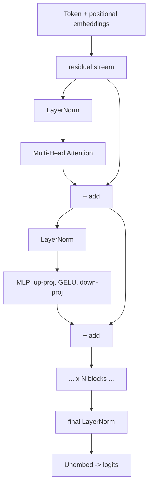

# Transformer / LLM Architecture

> Topic package — Domain 2 · Roadmap Weeks 08/10.
> Depth goal: assemble a full decoder-only transformer block from its parts, understand residual streams, layer norm placement, the MLP, and how depth+width scale.

## Source
- Track: LLM Engineering (self-directed, FDE roadmap)
- Slide deck: `07 Resources Library/LLM Engineering/Slides/Lesson_08_Transformer_Architecture.pptx`
- Hands-on notebook: `07 Resources Library/LLM Engineering/Notebooks/08_Transformer_Architecture.ipynb` (runs offline)
- Reference reading: Vaswani et al. (arXiv:1706.03762); Radford et al. GPT-2; Karpathy nanoGPT; 'The Illustrated GPT-2' (Alammar); Elhage et al. 'A Mathematical Framework for Transformer Circuits' (Anthropic)
- Builds on: [[02 Literature Notes/LLM Engineering/Attention Deep-Dive]]
- Date: 2026-07-18

---

## 1. Mental Model

**A transformer is a stack of identical blocks that repeatedly read from and write to a shared 'residual stream'.** Each block does two things: (1) attention mixes information *across tokens*, and (2) an MLP processes each token *independently*. Both are wrapped in residual connections and layer norm.

The residual stream is the backbone: every block *adds* its output to it rather than replacing it. Information flows forward largely untouched unless a block chooses to write to it. Attention moves information between positions; the MLP transforms information at a position (it's where much factual "knowledge" lives).

> Key intuition: **attention = communication between tokens; MLP = computation within a token.** Stack N of these blocks, add embeddings in at the bottom and an unembedding (logits) at the top, and you have a GPT.



---

## 2. How It Actually Works

### 2.1 The residual stream
Each sublayer computes `x = x + sublayer(norm(x))`. The `x +` is the residual (skip) connection. It gives gradients a direct path to every layer (solving the vanishing-gradient problem that limited deep nets) and creates a shared communication channel that all blocks read from and write to. Interpretability research treats the residual stream as the model's 'memory bus'.

### 2.2 The transformer block
A decoder block = **pre-norm attention** + **pre-norm MLP**, each residual-added:

```
x = x + MHA(LayerNorm(x))     # mix across tokens
x = x + MLP(LayerNorm(x))     # process each token
```

Modern LLMs use **pre-norm** (LayerNorm *before* the sublayer) because it trains more stably at depth than the original post-norm. RMSNorm often replaces LayerNorm for speed.

### 2.3 The MLP (feed-forward)
Two linear layers with a nonlinearity, applied identically to every position:

$$\text{MLP}(x) = W_{down}\,\phi(W_{up}\,x), \quad \phi \in \{\text{GELU, SwiGLU}\}$$

The hidden dimension is typically **4× d_model**, so the MLP holds most of the parameters. This is widely believed to be where much of the model's factual/associative knowledge is stored (key-value memories).

### 2.4 Embeddings in, logits out
Bottom: token IDs → embedding lookup, plus positional information (learned, sinusoidal, or **RoPE** applied inside attention). Top: a final norm, then an unembedding matrix maps the residual stream to vocabulary logits. Many models **tie** the embedding and unembedding weights.

### 2.5 Depth, width, and scale
Model size ≈ `12 · n_layers · d_model²` (attention + MLP params). Scaling laws (Kaplan; Chinchilla) say loss falls predictably with parameters, data, and compute — and that most models are *under-trained* on data relative to their size. This is why '7B trained on 2T tokens' beats '13B trained on 300B'.

---

## 3. Implementation

Assumed stack: `numpy` for the forward pass (no training). Snippets:
- [[04 Code Snippets/LLM/A Transformer Block Forward Pass]]
- [[04 Code Snippets/LLM/Counting Transformer Parameters]]

### A Transformer Block Forward Pass
Pre-norm decoder block: attention + MLP with residuals, in numpy.
```python
import numpy as np
def softmax(x, ax=-1):
    x = x - x.max(ax, keepdims=True); e = np.exp(x); return e / e.sum(ax, keepdims=True)
def layernorm(x, g, b, eps=1e-5):
    mu = x.mean(-1, keepdims=True); var = x.var(-1, keepdims=True)
    return g * (x - mu) / np.sqrt(var + eps) + b
def gelu(x): return 0.5 * x * (1 + np.tanh(0.797885 * (x + 0.044715 * x**3)))

def attn(x, Wqkv, Wo, causal=True):
    seq, d = x.shape
    Q, K, V = (x @ Wqkv).reshape(seq, 3, d).transpose(1, 0, 2)
    s = Q @ K.T / np.sqrt(d)
    if causal: s = np.where(np.triu(np.ones((seq, seq)), 1).astype(bool), -1e9, s)
    return (softmax(s) @ V) @ Wo

def block(x, p):
    x = x + attn(layernorm(x, p['g1'], p['b1']), p['Wqkv'], p['Wo'])
    h = gelu(layernorm(x, p['g2'], p['b2']) @ p['Wup'])
    return x + h @ p['Wdown']

d, seq, ff = 16, 5, 64; rng = np.random.RandomState(0)
p = dict(g1=np.ones(d), b1=np.zeros(d), g2=np.ones(d), b2=np.zeros(d),
         Wqkv=rng.randn(d, 3*d)*.1, Wo=rng.randn(d, d)*.1,
         Wup=rng.randn(d, ff)*.1, Wdown=rng.randn(ff, d)*.1)
x = rng.randn(seq, d)
print("block output:", block(x, p).shape)
```

### Counting Transformer Parameters
Estimate parameter count and the attention/MLP split for any config.
```python
def params(n_layers, d_model, vocab, ff_mult=4):
    attn = 4 * d_model * d_model           # Wq,Wk,Wv,Wo
    mlp  = 2 * ff_mult * d_model * d_model # up + down
    per_layer = attn + mlp
    embed = vocab * d_model                # tied embed/unembed
    total = n_layers * per_layer + embed
    return total, attn / per_layer, mlp / per_layer

for name, (L, d, v) in {"GPT-2 small":(12,768,50257),
                        "GPT-2 XL":(48,1600,50257),
                        "7B-ish":(32,4096,32000)}.items():
    t, a, m = params(L, d, v)
    print(f"{name:<12} ~{t/1e6:>8.1f}M params   attn={a:.0%} mlp={m:.0%} per block")
```

---

## 4. Design Decisions & Tradeoffs

| Decision | Guidance |
|---|---|
| **Pre-norm vs post-norm** | Pre-norm for stable deep training (all modern LLMs); post-norm was the original and is finicky. |
| **LayerNorm vs RMSNorm** | RMSNorm is cheaper (no mean subtraction) and now common (LLaMA); LayerNorm is the classic. |
| **Activation** | GELU (GPT) or SwiGLU (LLaMA, usually best) over plain ReLU. |
| **Position encoding** | RoPE (rotary) for length generalization; learned/sinusoidal are simpler baselines. |
| **Depth vs width** | Scaling laws: balance params with data. Under-trained large models lose to well-trained smaller ones. |

---

## 5. Failure Modes & Gotchas

- Post-norm at depth without care → training instability / divergence.
- Forgetting the residual add → the network becomes untrainably deep.
- Placing norm after the residual add instead of before the sublayer (breaks pre-norm benefits).
- Assuming attention holds the parameters — the MLP (4× width) holds most of them.
- Ignoring scaling laws → over-sizing a model relative to available training tokens.

---

## 6. FDE Angle

- You can read a model card ('32 layers, d=4096, RoPE, SwiGLU, RMSNorm') and know exactly what it means.
- Parameter counting → VRAM/cost estimation for self-hosting decisions.
- Knowing the MLP holds knowledge explains why fine-tuning/LoRA targets specific layers.
- Scaling-law literacy stops clients from buying a bigger model when they need more/better data.

---

## 7. Self-Check

1. Draw a pre-norm decoder block with both residual connections.
2. Why does the residual stream help training and interpretability?
3. What does attention do that the MLP doesn't, and vice versa?
4. Roughly how many params in a 12-layer, d=768 model, and where do most live?
5. What do scaling laws say about a 13B model trained on 300B tokens?

## 8. Links
- Domain MOC: [[06 Maps of Content/LLM Engineering Concepts]]
- Code: [[04 Code Snippets/LLM/A Transformer Block Forward Pass]], [[04 Code Snippets/LLM/Counting Transformer Parameters]]
- Distilled: [[03 Permanent Notes/Attention Communicates Between Tokens the MLP Computes Within Them]], [[03 Permanent Notes/Scaling Laws Reward Data Not Just Parameters]]
- Upstream: [[02 Literature Notes/LLM Engineering/Attention Deep-Dive]] · Downstream: [[02 Literature Notes/LLM Engineering/Decoding and Sampling]]
