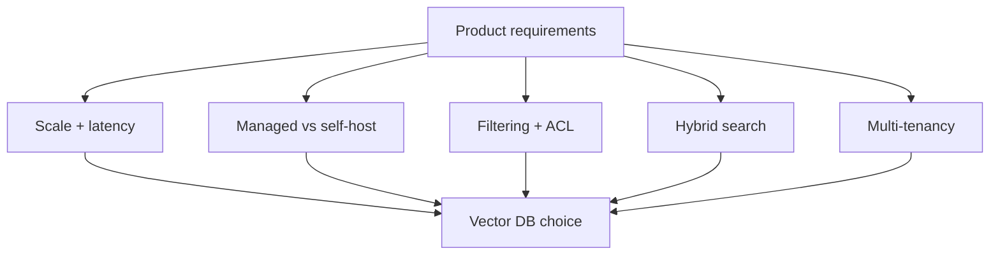

# Vector Database Landscape

> Topic package — Domain 4 · Roadmap Weeks 14/20.
> Depth goal: compare vector database options by deployment model, index algorithms, filtering, hybrid search, multi-tenancy, quantization, operational burden, and fit for RAG product requirements.

## Source
- Track: LLM Engineering (self-directed, FDE roadmap)
- Slide deck: `07 Resources Library/LLM Engineering/Slides/Lesson_23_Vector_Database_Landscape.pptx`
- Hands-on notebook: `07 Resources Library/LLM Engineering/Notebooks/23_Vector_Database_Landscape.ipynb` (runs offline)
- Reference reading: Chroma docs; Qdrant docs; Weaviate docs; Pinecone docs; Milvus docs; pgvector docs; FAISS docs; ANN-benchmarks; vendor hybrid search and filtering documentation
- Builds on: [[02 Literature Notes/LLM Engineering/Vector Search]] · [[02 Literature Notes/LLM Engineering/ANN Index Internals]] · [[02 Literature Notes/LLM Engineering/RAG Pipeline Fundamentals]]
- Date: 2026-07-18

---

## 1. Mental Model

**A vector database is not just a place to store embeddings; it is the operational retrieval layer for RAG.** It controls indexing, filtering, hybrid search, tenancy, updates, deletion, observability, and the latency/recall tradeoff users experience.

The landscape is a set of tradeoffs. FAISS is a library, not a service. Chroma is simple for local apps. pgvector keeps embeddings near relational data. Qdrant, Weaviate, Milvus, and Pinecone provide production vector services with different strengths in managed operations, hybrid search, scale, filtering, and multi-tenancy.

> Key intuition: **choose the retrieval operating model before choosing the vector database.** The right option depends on data scale, filters, hybrid needs, team ops capacity, tenant isolation, and latency SLOs.



---

## 2. How It Actually Works

### 4.1 The main categories
FAISS is an in-process ANN library: great for experiments and embedded/offline indexes, but you own persistence, serving, filters, and ops. Chroma emphasizes developer ergonomics/local RAG. pgvector adds vector indexes inside Postgres. Qdrant/Weaviate/Milvus/Pinecone are vector databases/services with APIs, metadata filtering, replication or managed options, and production operational features.

### 4.2 Managed vs self-host
Managed services reduce operational burden: scaling, backups, monitoring, upgrades, and availability. Self-host gives control over cost, data residency, and customization. The decision is often less about ANN accuracy and more about who will own incidents, migrations, and capacity planning.

### 4.3 Features that matter for RAG
RAG needs more than nearest neighbors: metadata filters (ACL, tenant, freshness), hybrid lexical+dense search, batch upserts/deletes, versioning, namespaces/collections, reranking integration, payload storage, and observability. If filters are slow or approximate, the system may leak data or miss evidence.

### 4.4 Index and compression tradeoffs
HNSW is common for high-recall low-latency search; IVF/PQ/quantization reduce memory at potential recall cost. ANN-benchmarks remind us there is no free lunch: recall, latency, memory, indexing time, and update behavior trade off. Evaluate with your embeddings, filters, and query distribution.

### 4.5 Selection framework
Small prototype: Chroma or FAISS. Postgres-first app with moderate scale and strong relational filters: pgvector. Need managed production with low ops: Pinecone or managed alternatives. Need open-source service with strong filtering: Qdrant/Weaviate/Milvus depending on scale and hybrid/ops preferences. Always run a proof-of-concept against your eval set.

---

## 3. Implementation

Assumed stack: stdlib + numpy. Snippets implement a decision matrix and a local ANN tradeoff simulator. Snippets:
- [[04 Code Snippets/LLM/Vector Store Selection Matrix]]
- [[04 Code Snippets/LLM/Local ANN Tradeoff Simulator]]

### Vector Store Selection Matrix
Score vector DB candidates against product requirements instead of vendor vibes.
```python
CANDIDATES = {
    "FAISS": {"managed":0, "simple":2, "filters":0, "hybrid":0, "ops":0},
    "Chroma": {"managed":0, "simple":3, "filters":1, "hybrid":1, "ops":1},
    "pgvector": {"managed":1, "simple":2, "filters":3, "hybrid":2, "ops":2},
    "Qdrant": {"managed":2, "simple":2, "filters":3, "hybrid":2, "ops":2},
    "Weaviate": {"managed":2, "simple":2, "filters":2, "hybrid":3, "ops":2},
    "Pinecone": {"managed":3, "simple":2, "filters":2, "hybrid":2, "ops":3},
    "Milvus": {"managed":1, "simple":1, "filters":2, "hybrid":2, "ops":2}}

def choose(weights):
    scores = {name: sum(features.get(k,0)*w for k,w in weights.items()) for name,features in CANDIDATES.items()}
    return sorted(scores.items(), key=lambda x: x[1], reverse=True)

print(choose({"managed":3, "filters":2, "hybrid":1, "ops":2})[:3])
```

### Local ANN Tradeoff Simulator
Simulate recall loss when searching only a candidate subset instead of exact nearest neighbors.
```python
import numpy as np
rng = np.random.RandomState(0)
vecs = rng.randn(200, 16); vecs /= np.linalg.norm(vecs, axis=1, keepdims=True)
q = rng.randn(16); q /= np.linalg.norm(q)
exact = set(np.argsort(vecs @ q)[-10:])

def approx_recall(candidate_fraction):
    n = int(len(vecs) * candidate_fraction)
    candidates = rng.choice(len(vecs), n, replace=False)
    found = set(candidates[np.argsort(vecs[candidates] @ q)[-10:]])
    return len(exact & found) / len(exact)

for frac in [0.1, 0.25, 0.5, 1.0]:
    print(frac, "recall@10", round(approx_recall(frac), 2))
```

---

## 4. Design Decisions & Tradeoffs

| Decision | Guidance |
|---|---|
| **Prototype choice** | Use FAISS/Chroma for local experiments; avoid over-optimizing infra before retrieval design is known. |
| **Postgres adjacency** | Use pgvector when relational filters, transactions, and existing Postgres ops matter more than extreme scale. |
| **Managed service** | Prefer managed when team lacks search/database ops capacity or needs uptime quickly. |
| **Hybrid search** | Require native or composable hybrid when exact terms, SKUs, or keyword constraints matter. |
| **Multi-tenancy** | Check namespaces, per-tenant filters, deletion, backups, and isolation guarantees. |
| **Benchmarking** | Benchmark with your embeddings, metadata filters, update rate, and eval queries — not vendor leaderboard claims. |

---

## 5. Failure Modes & Gotchas

- Choosing a vector DB solely from ANN benchmark recall without considering filters and deletion.
- Using a library like FAISS as if it handled serving, persistence, tenancy, and backups.
- Ignoring metadata filter performance until ACL filters become a latency bottleneck.
- Assuming hybrid search is available or equivalent across vendors.
- No plan for re-embedding, versioning, or deleting stale vectors.
- Locking into a managed vendor before testing export and migration paths.

---

## 6. FDE Angle

- Vector DB choice is an architecture decision, not a model choice.
- The FDE must map product requirements to retrieval operations: filters, tenants, updates, hybrid, SLOs.
- A small benchmark with the client's data beats generic vendor comparisons.
- Deliverable: a selection memo plus proof-of-concept metrics and operational risks.

---

## 7. Self-Check

1. Why is FAISS different from a vector database service?
2. When is pgvector a strong choice?
3. Which RAG features depend on metadata filtering?
4. What does hybrid search add beyond dense vectors?
5. What should be benchmarked before choosing a vendor?

## 8. Links
- Domain MOC: [[06 Maps of Content/LLM Engineering Concepts]]
- Code: [[04 Code Snippets/LLM/Vector Store Selection Matrix]], [[04 Code Snippets/LLM/Local ANN Tradeoff Simulator]]
- Distilled: [[03 Permanent Notes/Choose a Vector Database by Retrieval Operations Not Brand]], [[03 Permanent Notes/FAISS Is a Library While Vector Databases Are Retrieval Services]]
- Upstream: [[02 Literature Notes/LLM Engineering/Retrieval Evaluation]] · Downstream: [[02 Literature Notes/LLM Engineering/LLMOps]]
