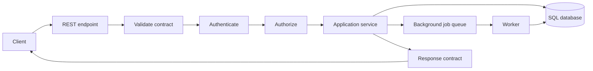

# APIs, Integration & Backend Engineering

> Topic package — Week 04 · Roadmap Week 04 — APIs, Integration & Backend Engineering.
> Depth goal: design backend interfaces that integrate reliably: clear REST resources, request/response contracts, authN/authZ boundaries, file-upload flows, background processing, versioning strategy, and safe database access.

## Source
- Track: Software Engineering (self-directed, FDE roadmap)
- Slide deck: `07 Resources Library/Software Engineering/Slides/Lesson_04_APIs,_Integration_&_Backend_Engineering.pptx`
- Hands-on notebook: `07 Resources Library/Software Engineering/Notebooks/04_APIs,_Integration_&_Backend_Engineering.ipynb` (runs offline)
- Reference reading: Fielding REST dissertation; FastAPI documentation concepts; OWASP API Security Top 10; RFC 9110 HTTP Semantics; PostgreSQL and SQLite documentation; Google API Improvement Proposals; Stripe API design examples
- Builds on: [[02 Literature Notes/Software Engineering/Data Structures, Algorithms & Complexity]]
- Date: 2026-07-18

---

## 1. Mental Model

**An API is a promise at a boundary: shape, behavior, security, latency, and evolution rules.** REST gives a resource-oriented vocabulary; request/response contracts make the boundary testable; authentication proves who is calling; authorization decides what they can do; background jobs protect request latency; databases make state durable; versioning lets clients and servers change safely.

Backend engineering is mostly boundary discipline. The handler should validate input, enforce identity and permissions, run a transaction or enqueue work, return a predictable response, and emit enough observability for debugging. FastAPI is a useful production tool, but the core ideas are framework-independent.

> Key intuition: **treat every integration as a contract plus an operations story** — what clients send, what they get back, who may call it, how failures surface, and how the contract changes without breaking them.



---

## 2. How It Actually Works

### 4.1 REST resources and HTTP contracts
REST APIs expose resources through URLs and use HTTP methods deliberately: `GET` reads, `POST` creates or starts processing, `PUT` replaces, `PATCH` partially updates, and `DELETE` removes. Status codes are part of the contract: `200/201/202` for success variants, `400` for invalid input, `401` unauthenticated, `403` unauthorized, `404` not found, `409` conflict, `422` semantic validation, `429` limited, and `5xx` server failure.

The contract includes headers, idempotency keys, pagination, error envelope, correlation id, and timeout expectations. A good API is boring: stable names, explicit schemas, predictable errors, and examples clients can paste into tests.

### 4.2 Validation and FastAPI-style handler shape
FastAPI popularized a clean shape: typed request model, dependency-injected auth, application function, typed response model, and automatic docs. You do not need a running server to practice the architecture. A local function can simulate the same boundary: parse a dict, validate fields, enforce auth, call a service, and return a response dict.

Validation belongs at the edge. Convert untrusted input into domain objects once, reject extra or malformed fields intentionally, and keep the core application code free of HTTP-specific details. That separation is what lets an FDE swap CLI, notebook, webhook, or REST adapters around the same workflow.

### 4.3 Authentication, authorization, and tokens
Authentication (AuthN) answers 'who is this caller?' Authorization (AuthZ) answers 'what may this caller do to this resource?' API keys identify applications; bearer tokens represent principals and scopes; sessions fit browser apps; mTLS and signed requests appear in enterprise integrations. Do not blur identity with permission: a valid token can still lack access to a tenant, file, or action.

Token patterns require operational choices: expiration, rotation, revocation, audience, issuer, scopes/roles, tenant binding, and audit logging. The safest handler checks AuthN first, then AuthZ against the specific resource, then executes the action.

### 4.4 Uploads, background jobs, and async processing
File uploads and slow work should not hold request threads hostage. Validate metadata and size, store the blob or staged content, create a job record, return `202 Accepted` with a job id, and process asynchronously. The worker updates status and stores results; clients poll or receive a webhook/callback. This makes latency predictable and isolates retries from user requests.

Background jobs need idempotency, status states, retry policy, dead-letter handling, progress visibility, and authorization on job reads. Async code is about concurrency around waiting, not making CPU work magically faster; use it for many I/O-bound tasks and keep shared-state mutation disciplined.

### 4.5 Databases, SQL basics, and API versioning
Relational databases store durable state in tables; SQL selects, filters, joins, groups, inserts, updates, and deletes. Backend safety starts with parameterized queries, transactions for multi-step changes, constraints for invariants, indexes for lookup paths, and migrations for schema evolution. Avoid building SQL with string concatenation from user input.

Versioning is how contracts evolve. Prefer additive changes first: new optional fields, new endpoints, tolerant clients. Use explicit versions when semantics break, and maintain deprecation windows. Database migrations and API versions must be planned together; a handler can often serve old and new response shapes from the same internal model during transition.

---

## 3. Implementation

Assumed stack: Python stdlib only. Snippets simulate FastAPI-style request handling, validation, auth, async background jobs, and SQL locally. Snippets:
- [[04 Code Snippets/Software Engineering/SE Week 04 Dataclass API Contract Handler]]
- [[04 Code Snippets/Software Engineering/SE Week 04 Async Job Queue and SQLite Demo]]

### SE Week 04 Dataclass API Contract Handler
A FastAPI-like handler without a server: validate request dicts, enforce auth, and return a response contract.
```python
from dataclasses import dataclass

@dataclass(frozen=True)
class CreateTicketRequest:
    title: str
    priority: int

@dataclass(frozen=True)
class TicketResponse:
    id: int
    title: str
    status: str

def parse_create_ticket(payload):
    title = payload.get("title")
    priority = payload.get("priority")
    if not isinstance(title, str) or not title.strip():
        raise ValueError("title must be a non-empty string")
    if not isinstance(priority, int) or not 1 <= priority <= 5:
        raise ValueError("priority must be an integer 1..5")
    return CreateTicketRequest(title=title.strip(), priority=priority)

def require_scope(token, scope):
    scopes = set(token.get("scopes", []))
    if scope not in scopes:
        raise PermissionError(f"missing scope: {scope}")

def create_ticket_handler(payload, token):
    require_scope(token, "tickets:write")
    req = parse_create_ticket(payload)
    return TicketResponse(id=1, title=req.title, status="open")

print(create_ticket_handler({"title": "Latency spike", "priority": 2}, {"sub": "u1", "scopes": ["tickets:write"]}))
```

### SE Week 04 Async Job Queue and SQLite Demo
A local background-job queue using asyncio plus sqlite3 persistence; no server or network required.
```python
import asyncio, sqlite3

async def worker(queue, db):
    while True:
        job_id, payload = await queue.get()
        if job_id is None:
            queue.task_done()
            break
        result = payload.upper()
        db.execute("UPDATE jobs SET status=?, result=? WHERE id=?", ("done", result, job_id))
        db.commit()
        queue.task_done()

async def main():
    db = sqlite3.connect(":memory:")
    db.execute("CREATE TABLE jobs (id INTEGER PRIMARY KEY, status TEXT, result TEXT)")
    q = asyncio.Queue()
    task = asyncio.create_task(worker(q, db))
    for payload in ["parse file", "embed chunks"]:
        cur = db.execute("INSERT INTO jobs(status, result) VALUES (?, ?)", ("queued", None))
        await q.put((cur.lastrowid, payload))
    await q.put((None, None))
    await q.join()
    await task
    print(db.execute("SELECT id, status, result FROM jobs ORDER BY id").fetchall())

asyncio.run(main())
```

---

## 4. Design Decisions & Tradeoffs

| Decision | Guidance |
|---|---|
| **Resource modeling** | Model URLs around nouns and stable business resources; use verbs for operations only when no durable resource exists or when starting a process. |
| **Status code selection** | Return precise status codes and a consistent error envelope so clients can branch safely without parsing prose. |
| **Auth boundary** | Authenticate every request before application logic; authorize against the exact tenant/resource/action, not just a coarse role. |
| **Sync vs background** | Keep requests synchronous for quick deterministic work; return `202 + job_id` for uploads, model calls, imports, and anything retryable or slow. |
| **Database access** | Use parameterized SQL, constraints, indexes, and transactions; keep DB rows separate from public API response models. |
| **Versioning strategy** | Prefer additive contract changes; introduce explicit versions and deprecation plans for semantic breaks. |

---

## 5. Failure Modes & Gotchas

- Returning ad-hoc error strings per endpoint → clients cannot reliably handle failures.
- Checking authentication but not resource-level authorization → cross-tenant data exposure.
- Running slow file parsing or model calls inside the HTTP request → timeouts and duplicate client retries.
- Constructing SQL with string interpolation from request data → injection risk and quoting bugs.
- Changing response semantics in place with no version or deprecation window → downstream client breakage.
- Treating background jobs as fire-and-forget with no status, idempotency, retry, or dead-letter story.

---

## 6. FDE Angle

- FDE integrations succeed when clients can see and test the contract: example requests, schemas, error envelopes, auth scopes, and versioning notes.
- Enterprise deployments require AuthN/AuthZ clarity; being able to explain tenant isolation and token scope checks is often as important as the feature.
- AI workflows usually need background processing for uploads, indexing, evaluation, and long model calls; `202 + job_id` is a practical product pattern.
- Deliverable: a contract-first API slice with local tests, SQL migration/query notes, operational logs, and a documented failure/retry model.

---

## 7. Self-Check

1. What is the difference between authentication and authorization?
2. When should an endpoint return `202 Accepted` instead of `200 OK`?
3. What belongs in a stable API error envelope?
4. Why should SQL queries be parameterized?
5. How do additive API changes differ from breaking semantic changes?
6. Where should request validation live relative to domain logic?

## 8. Links
- Domain MOC: [[06 Maps of Content/Software Engineering Concepts]]
- Code: [[04 Code Snippets/Software Engineering/SE Week 04 Dataclass API Contract Handler]], [[04 Code Snippets/Software Engineering/SE Week 04 Async Job Queue and SQLite Demo]]
- Distilled: [[03 Permanent Notes/SE Week 04 REST API Design Checklist]], [[03 Permanent Notes/SE Week 04 AuthN vs AuthZ and Token Patterns]]
- Upstream: [[02 Literature Notes/Software Engineering/Data Structures, Algorithms & Complexity]] · Downstream: [[06 Maps of Content/Software Engineering Concepts]]
