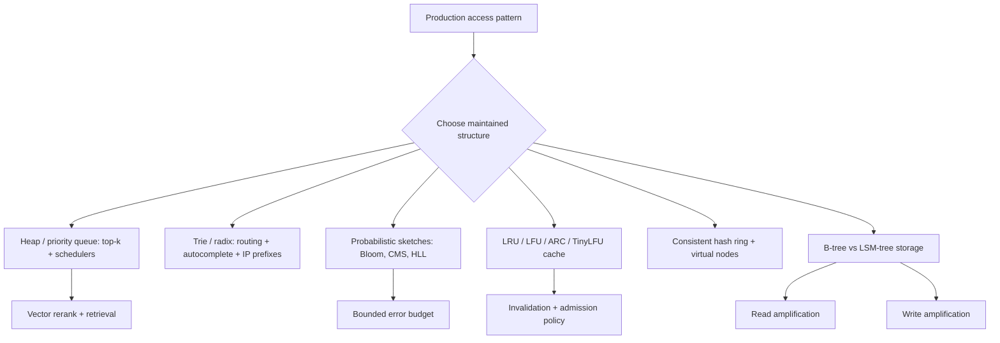

# Applied Data Structures for Backend and AI

> Topic package — Week 03+ · Roadmap Week 03+ — Applied Data Structures for Backend and AI.
> Depth goal: select and implement the production data structures that show up in backend infrastructure, databases, caches, stream processing, and LLM/vector retrieval systems — with realistic error bounds, memory costs, and failure modes.

## Source
- Track: Software Engineering (self-directed, FDE roadmap)
- Slide deck: `07 Resources Library/Software Engineering/Slides/Lesson_07_Applied_Data_Structures_for_Backend_and_AI.pptx`
- Hands-on notebook: `07 Resources Library/Software Engineering/Notebooks/07_Applied_Data_Structures_for_Backend_and_AI.ipynb` (runs offline)
- Reference reading: Designing Data-Intensive Applications; Redis internals; RocksDB and Cassandra architecture notes; Caffeine TinyLFU papers; Flajolet HyperLogLog; Bloom filter and Cuckoo filter papers; Dynamo consistent hashing and Merkle anti-entropy; PostgreSQL B-tree indexes
- Builds on: [[02 Literature Notes/Software Engineering/Data Structures, Algorithms & Complexity]]
- Date: 2026-07-18

---

## 1. Mental Model

**Production DSA is not about reciting structures; it is about choosing the state shape that preserves latency, memory, and correctness when data stops fitting in one request.** Backends use heaps for top-k and schedulers, tries for prefixes, sketches for approximate telemetry, caches for repeated work, consistent hashing for placement, and storage trees for read/write tradeoffs.

The key distinction is exact versus approximate, in-memory versus persisted, and per-request versus continuously maintained. A Bloom filter saves disk reads by accepting a tunable false-positive rate; a Count-Min Sketch gives frequency estimates with one-sided error; HyperLogLog trades exact counts for fixed memory; a heap avoids sorting all candidates when only the best k matter.

> Key intuition: **make the common query cheap, then name the approximation, invalidation, or write-amplification cost you accepted.**



---

## 2. How It Actually Works

### 3+.1 Top-k, priority, and prefix structures in hot paths
A heap is the production answer when you need the best `k` out of `n` without ordering the whole collection. Full sort is `O(n log n)`; heap top-k is `O(n log k)` and keeps only `k` candidates. In vector retrieval reranking, `n=100_000` candidates and `k=20` is common enough that avoiding a full sort saves CPU and memory churn. The same priority-queue pattern powers task schedulers, delayed retries, and Dijkstra-style routing.

Tries and radix trees optimize prefix lookup: HTTP routers, autocomplete, feature-flag namespaces, and longest-prefix IP routing. A naive trie can be pointer-heavy; radix compression collapses single-child chains to reduce memory. The tradeoff is implementation complexity and update cost versus predictable `O(length_of_key)` lookup independent of total routes.

### 3+.2 Probabilistic membership and frequency sketches
Bloom filters answer set membership with **no false negatives** and a tunable false-positive probability `p ≈ (1 - e^{-kn/m})^k`, where `m` is bits, `k` hash functions, and `n` inserted keys. Teams put them in front of object stores, RocksDB SSTables, duplicate checks, and crawler frontiers to avoid expensive negative lookups. Counting Bloom filters add counters so deletes are possible; Cuckoo filters support deletion and often better practical lookup locality.

Count-Min Sketch estimates frequencies with one-sided overcount error. It is useful for heavy hitters, abuse detection, cache admission, and telemetry when exact per-key maps would explode memory. The production move is to set a memory budget and error budget explicitly, then validate the sketch against a sample of exact counts.

### 3+.3 Cardinality, clustering, and streaming windows
HyperLogLog estimates unique counts using fixed memory: around 1.04/sqrt(m) relative standard error for `m` registers. With 16,384 registers the error is roughly 0.8%, which is often good enough for unique users, unique documents, and deduped embeddings where exact sets would cost gigabytes.

Union-find tracks connectivity with near-constant amortized operations when using path compression and union by rank. It appears in near-duplicate clustering, connected components, image/document grouping, and incremental graph construction. Sliding-window and two-pointer patterns power rate limiters, rolling metrics, stream joins, and chunk-window generation; the real requirement is an eviction rule tied to event time or monotonic processing time.

### 3+.4 Cache eviction and distributed placement
LRU is simple and good for recency-heavy workloads, but it fails on scans that evict the working set. LFU keeps frequent keys but can retain stale popularity. ARC adapts between recency and frequency; TinyLFU uses a frequency sketch for admission so one-hit wonders do not displace valuable entries. Caffeine's W-TinyLFU pattern is a named production design: small admission window plus sketch-based admission plus segmented eviction.

Consistent hashing maps keys to nodes so adding/removing a node moves roughly `1/N` of keys instead of reshuffling everything. Virtual nodes smooth load imbalance; hundreds of vnodes per physical node are common in caches and sharded services. The tradeoff is operational: placement becomes stable, but hot keys, uneven node capacity, and replica selection still need monitoring.

### 3+.5 Storage trees, integrity trees, and database tradeoffs
B-trees optimize ordered reads and point/range lookups with page-friendly fanout; they underpin Postgres indexes. Writes update pages in place and can pay random I/O and page splits. LSM-trees optimize writes by appending to memtables and immutable sorted files, then compacting later; Cassandra and RocksDB accept read amplification and compaction debt for high write throughput.

Skip lists provide ordered operations with probabilistic levels and simpler concurrent updates; Redis sorted sets use skip-list-like internals. Merkle trees hash subtrees so replicas can compare ranges efficiently; Git, Dynamo anti-entropy, and blockchains use this integrity pattern. These structures are not interchangeable: choose by read/write ratio, range-query needs, compaction budget, and repair model.

---

## 3. Implementation

Assumed stack: Python stdlib plus numpy for local vector-score generation. Snippets demonstrate approximate membership and heap-based retrieval without network access. Snippets:
- [[04 Code Snippets/Software Engineering/SE Week 03+ Bloom Filter False Positive Demo]]
- [[04 Code Snippets/Software Engineering/SE Week 03+ Heap Top K Vector Retriever]]

### SE Week 03+ Bloom Filter False Positive Demo
A small Bloom filter with double hashing and an empirical false-positive rate compared to the theoretical formula.
```python
import hashlib, math, random

class BloomFilter:
    def __init__(self, bits, hashes):
        self.bits = bits
        self.hashes = hashes
        self.array = bytearray((bits + 7) // 8)

    def _indexes(self, item):
        digest = hashlib.sha256(str(item).encode()).digest()
        h1 = int.from_bytes(digest[:8], 'big')
        h2 = int.from_bytes(digest[8:16], 'big') or 1
        for i in range(self.hashes):
            yield (h1 + i * h2) % self.bits

    def add(self, item):
        for idx in self._indexes(item):
            self.array[idx // 8] |= 1 << (idx % 8)

    def __contains__(self, item):
        return all(self.array[idx // 8] & (1 << (idx % 8)) for idx in self._indexes(item))

n, m, k = 5_000, 80_000, 7
bf = BloomFilter(bits=m, hashes=k)
for i in range(n):
    bf.add(f'user:{i}')

trials = 20_000
false_pos = sum(1 for i in range(n, n + trials) if f'user:{i}' in bf)
empirical = false_pos / trials
theoretical = (1 - math.exp(-k * n / m)) ** k
print(f'empirical={empirical:.4f} theoretical={theoretical:.4f}')
print('false negatives:', sum(1 for i in range(n) if f'user:{i}' not in bf))
```

### SE Week 03+ Heap Top K Vector Retriever
Use heapq.nlargest over numpy similarity scores so retrieval keeps only k winners instead of sorting every candidate.
```python
import heapq
import numpy as np

rng = np.random.default_rng(7)
doc_ids = np.array([f'doc-{i}' for i in range(50_000)])
scores = rng.random(len(doc_ids))
k = 5

def topk_heap(ids, scores, k):
    pairs = zip(scores.tolist(), ids.tolist())
    return [(doc_id, score) for score, doc_id in heapq.nlargest(k, pairs)]

def topk_sort(ids, scores, k):
    order = np.argsort(scores)[-k:][::-1]
    return [(ids[i], float(scores[i])) for i in order]

heap_result = topk_heap(doc_ids, scores, k)
sort_result = topk_sort(doc_ids, scores, k)
print(heap_result)
print('same ids:', [d for d, _ in heap_result] == [d for d, _ in sort_result])
print('heap keeps O(k) winners; full sort orders all n candidates')
```

---

## 4. Design Decisions & Tradeoffs

| Decision | Guidance |
|---|---|
| **Exact vs approximate** | Use exact sets/maps when correctness requires it; use Bloom, CMS, or HLL when memory is bounded and false positives or small error are acceptable and measured. |
| **Heap vs full sort** | Use heap top-k for large `n` and small `k`; use full sort when you need complete ordering, stable tie behavior, or repeated range scans. |
| **Trie vs hash lookup** | Use tries/radix trees for prefix and longest-prefix queries; use hash maps for exact-key lookup with lower implementation complexity. |
| **LRU vs TinyLFU** | Use LRU for simple recency workloads; use TinyLFU-style admission when scans or one-hit keys evict valuable cached entries. |
| **B-tree vs LSM-tree** | Choose B-tree for read-heavy ordered/range workloads; choose LSM when write throughput matters and compaction/read amplification are acceptable. |
| **Consistent hashing strategy** | Use virtual nodes and capacity weights for shard/cache placement; separately handle hot-key replication and rebalance observability. |

---

## 5. Failure Modes & Gotchas

- Using a Bloom filter as an authorization or deletion source of truth → false positives grant or retain access incorrectly.
- Full-sorting every vector candidate for top-10 retrieval → CPU spikes and p99 latency regressions as corpus size grows.
- Letting an LRU cache absorb one-time scans → the working set is evicted and downstream databases see a thundering herd.
- Adding a shard without consistent hashing or migration planning → most cache keys move and warm capacity disappears at once.
- Choosing an LSM store for range-heavy read paths without budgeting compaction and read amplification → tail latency cliffs.
- Implementing sliding windows by wall-clock timestamps without monotonic/event-time rules → duplicate or missing rate-limit decisions under clock skew.

---

## 6. FDE Angle

- Vector search systems use heap top-k, approximate membership, cache admission, and shard placement on every RAG path; FDEs must explain latency and recall tradeoffs to clients.
- Enterprise AI ingestion needs dedupe and near-duplicate clustering; Bloom filters, HLL, and union-find turn impossible exact bookkeeping into bounded-memory workflows.
- LLM job platforms depend on priority queues, idempotent schedulers, consistent hashing, and cache policies to keep tenant workloads fair and predictable.
- When choosing storage for embeddings, chunks, traces, or audit logs, the B-tree versus LSM decision becomes a product SLA decision: read latency, write rate, retention, and repair.

---

## 7. Self-Check

1. Why is heap top-k `O(n log k)` and when does that beat sorting?
2. What are the false-positive and false-negative guarantees of a Bloom filter?
3. When would Counting Bloom or Cuckoo filters beat a plain Bloom filter?
4. How does TinyLFU protect a cache from scan pollution?
5. What moves when a node is added to a consistent-hash ring with virtual nodes?
6. Why does an LSM-tree improve writes while creating compaction and read-amplification risk?

## 8. Links
- Domain MOC: [[06 Maps of Content/Software Engineering Concepts]]
- Code: [[04 Code Snippets/Software Engineering/SE Week 03+ Bloom Filter False Positive Demo]], [[04 Code Snippets/Software Engineering/SE Week 03+ Heap Top K Vector Retriever]]
- Distilled: [[03 Permanent Notes/SE Week 03+ Probabilistic Data Structures Cheat Sheet]], [[03 Permanent Notes/SE Week 03+ B-Tree vs LSM-Tree Decision Guide]]
- Upstream: [[02 Literature Notes/Software Engineering/Data Structures, Algorithms & Complexity]] · Downstream: [[02 Literature Notes/Software Engineering/APIs, Integration & Backend Engineering]]
