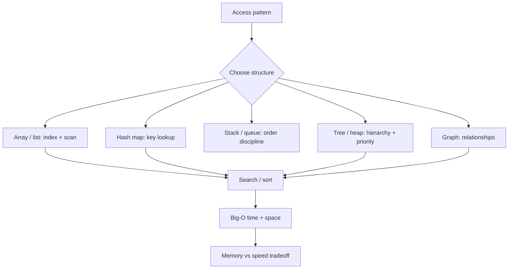

# Data Structures, Algorithms & Complexity

> Topic package — Week 03 · Roadmap Week 03 — Data Structures, Algorithms & Complexity.
> Depth goal: refresh core data structures and algorithms well enough to select the right representation, reason about Big-O time and space, and explain memory-vs-speed tradeoffs in production designs.

## Source
- Track: Software Engineering (self-directed, FDE roadmap)
- Slide deck: `07 Resources Library/Software Engineering/Slides/Lesson_03_Data_Structures,_Algorithms_&_Complexity.pptx`
- Hands-on notebook: `07 Resources Library/Software Engineering/Notebooks/03_Data_Structures,_Algorithms_&_Complexity.ipynb` (runs offline)
- Reference reading: CLRS; Algorithms (Sedgewick & Wayne); The Algorithm Design Manual (Skiena); Python TimeComplexity wiki; Designing Data-Intensive Applications chapters on indexes and data models
- Builds on: [[02 Literature Notes/Software Engineering/System Design Fundamentals]]
- Date: 2026-07-18

---

## 1. Mental Model

**Data structures are the shape of your constraints; algorithms are the cost model of your choices.** Arrays optimize contiguous scans and indexed access; hash maps optimize key lookup; stacks and queues encode processing order; trees maintain hierarchy or sorted access; graphs model relationships; search and sorting turn raw data into retrievable structure.

Big-O is not a trivia game — it is a negotiation between input growth, latency, memory, cache locality, implementation complexity, and operational risk. A theoretically faster algorithm can lose on tiny inputs or poor locality; a memory-heavy index can be correct but unaffordable; a one-pass hash map can convert nested loops into linear time by spending space.

> Key intuition: **pick the representation that makes the common operation cheap** — then verify the hidden cost in memory, constants, and worst-case behavior.



---

## 2. How It Actually Works

### 3.1 Big-O as a growth budget
Big-O describes how work grows as input grows: `O(1)` constant, `O(log n)` divide-and-conquer, `O(n)` scan, `O(n log n)` comparison sorting, `O(n^2)` pairwise comparisons, and `O(2^n)` combinatorial explosion. For engineering, it is a budget conversation: what is `n`, how large can it get, what is the p95 latency target, and which path runs per request versus offline?

Do not confuse asymptotic class with observed speed. Constants, allocation, branch prediction, cache locality, language overhead, and data distribution matter. Big-O tells you which design survives growth; benchmarks and profiling tell you whether the current implementation meets today's SLA.

### 3.2 Arrays, hash maps, stacks, and queues
Arrays/lists give compact storage, fast iteration, and `O(1)` index access, but insertion/deletion in the middle shifts elements. Hash maps trade memory and hashing cost for average `O(1)` lookup, insertion, and membership checks; they are the standard move for replacing repeated scans with a precomputed index. Collisions and adversarial keys matter at system boundaries, but most application code benefits enormously from map-based joins and dedupe.

Stacks (LIFO) and queues (FIFO) are not exotic — they encode control flow. DFS uses a stack; BFS and job processing use queues. Choosing the order discipline makes the algorithm easier to reason about and often reveals whether you need bounded memory, fairness, or shortest-path-by-edges behavior.

### 3.3 Trees, heaps, and graphs
Trees encode hierarchy and ordered search. Balanced search trees keep insert/search/delete near `O(log n)` and underpin many indexes. Heaps give `O(log n)` push/pop for priority queues, scheduling, top-k, and shortest-path algorithms. Tries optimize prefix lookup at the cost of pointer-heavy memory usage.

Graphs model arbitrary relationships: dependencies, social links, network routes, entity relationships, workflow states. The representation is a major decision. Adjacency lists are sparse and practical; adjacency matrices make edge checks `O(1)` but cost `O(V^2)` memory. BFS gives shortest path in unweighted graphs; DFS is useful for reachability, cycle detection, and topological reasoning.

### 3.4 Search and sorting as structure-building
Linear search is fine for tiny or unsorted data; binary search needs sorted data and gives `O(log n)` lookup with excellent locality. Sorting costs upfront `O(n log n)` for comparison sorts, then enables binary search, merge joins, dedupe, range queries, and predictable presentation. Python's Timsort exploits existing order, which is why real-world partially sorted data can beat textbook expectations.

The senior question is not 'which sort is fastest?' but 'should this request path sort at all?' If the same data is searched repeatedly, build and maintain an index. If the data is one-off and tiny, the simple scan may be more reliable and faster than a clever structure.

### 3.5 Memory vs speed and correctness tradeoffs
Most algorithmic wins spend memory to buy time: hash-map indexes, memoization caches, Bloom filters, precomputed sorted views, graph adjacency maps, and materialized aggregates. That memory has costs: stale data, invalidation, higher GC pressure, serialization overhead, tenant isolation, and capacity planning.

Correctness also changes with representation. Floating-point sort keys, duplicate handling, stable ordering, graph cycles, recursive depth, and mutation while iterating are real production bugs. For FDE work, explain the trade in client terms: latency saved, memory spent, freshness guarantee, and failure mode when the assumption is violated.

---

## 3. Implementation

Assumed stack: Python stdlib only. Snippets implement graph traversal and search/sort/index tradeoffs with tiny offline examples. Snippets:
- [[04 Code Snippets/Software Engineering/SE Week 03 Graph BFS DFS Traversal]]
- [[04 Code Snippets/Software Engineering/SE Week 03 Binary Search Sort and Hash Index]]

### SE Week 03 Graph BFS DFS Traversal
Adjacency-list graph traversal showing BFS shortest-hop order vs DFS reachability order.
```python
from collections import deque

graph = {
    "A": ["B", "C"],
    "B": ["D", "E"],
    "C": ["F"],
    "D": [],
    "E": ["F"],
    "F": [],
}

def bfs(start):
    seen, order, q = {start}, [], deque([start])
    while q:
        node = q.popleft()
        order.append(node)
        for nxt in graph[node]:
            if nxt not in seen:
                seen.add(nxt)
                q.append(nxt)
    return order

def dfs(start):
    seen, order, stack = set(), [], [start]
    while stack:
        node = stack.pop()
        if node in seen:
            continue
        seen.add(node)
        order.append(node)
        stack.extend(reversed(graph[node]))
    return order

print("BFS:", bfs("A"))
print("DFS:", dfs("A"))
```

### SE Week 03 Binary Search Sort and Hash Index
Compare linear scan, binary search over sorted data, and a hash-map index for repeated lookup.
```python
from bisect import bisect_left

rows = [("u3", "Chen"), ("u1", "Ada"), ("u4", "Diaz"), ("u2", "Grace")]

def linear_find(rows, user_id):
    for uid, name in rows:
        if uid == user_id:
            return name
    return None

sorted_rows = sorted(rows)
ids = [uid for uid, _ in sorted_rows]

def binary_find(user_id):
    i = bisect_left(ids, user_id)
    if i < len(ids) and ids[i] == user_id:
        return sorted_rows[i][1]
    return None

index = dict(rows)
print(linear_find(rows, "u2"), binary_find("u2"), index["u2"])
print("one-off tiny input: scan is fine; repeated lookup: build an index")
```

---

## 4. Design Decisions & Tradeoffs

| Decision | Guidance |
|---|---|
| **Representation by operation** | Start from dominant operations: indexed access, membership, ordered range, priority, traversal, or mutation; choose the structure that makes those cheap. |
| **Hash map vs scan** | Use scans for tiny one-off data and maps for repeated membership/joins/dedupe; document memory cost and key correctness. |
| **Sort vs maintain index** | Sort once for batch/range work; maintain an index when reads repeat and update complexity is acceptable. |
| **BFS vs DFS** | Use BFS for shortest unweighted path and level order; use DFS for reachability, cycle detection, and exhaustive search with stack discipline. |
| **Recursive vs iterative** | Prefer iterative traversal when depth is untrusted; recursion is elegant but risks stack limits and poor failure behavior. |
| **Benchmark vs Big-O** | Use Big-O to reject non-scaling designs, then benchmark representative inputs to catch constants, allocations, and locality effects. |

---

## 5. Failure Modes & Gotchas

- Using nested loops for joins or dedupe when a hash index would turn `O(n*m)` into `O(n+m)`.
- Sorting inside a hot request path on every call instead of precomputing or maintaining an index.
- Applying binary search to data that is not sorted by the exact key being searched.
- Using recursion for unbounded trees/graphs and hitting recursion limits or stack overflow in production data.
- Ignoring graph cycles and revisiting nodes forever or double-counting side effects.
- Quoting Big-O without measuring constants, allocation pressure, and realistic input sizes.

---

## 6. FDE Angle

- FDEs often inherit messy client data; a quick index, dedupe map, or graph traversal can turn a slow demo into a credible workflow without new infrastructure.
- Algorithm choices should be explainable to stakeholders as latency, memory, and freshness tradeoffs, not academic vocabulary.
- For AI systems, retrieval, chunk scheduling, dependency graphs, cache keys, and evaluation aggregation all depend on these fundamentals.
- Deliverable: state the expected data size, dominant operations, chosen structure, complexity, and the benchmark that proves it is good enough.

---

## 7. Self-Check

1. What operation does an array/list make cheap, and what operation does it make expensive?
2. When does a hash map convert a quadratic algorithm into a linear one?
3. Why does binary search require sorted data, and what is the upfront cost?
4. When would BFS be the right graph traversal over DFS?
5. What memory-vs-speed tradeoff are you making when you build an index?
6. Why can an `O(n)` algorithm beat an `O(log n)` algorithm on tiny inputs?

## 8. Links
- Domain MOC: [[06 Maps of Content/Software Engineering Concepts]]
- Code: [[04 Code Snippets/Software Engineering/SE Week 03 Graph BFS DFS Traversal]], [[04 Code Snippets/Software Engineering/SE Week 03 Binary Search Sort and Hash Index]]
- Distilled: [[03 Permanent Notes/SE Week 03 Big-O Complexity Cheat Sheet]], [[03 Permanent Notes/SE Week 03 Choosing the Right Data Structure]]
- Upstream: [[02 Literature Notes/Software Engineering/System Design Fundamentals]] · Downstream: [[02 Literature Notes/Software Engineering/APIs, Integration & Backend Engineering]]
