# Distributed Systems Reality

> Topic package — Week 02+ · Roadmap Week 02+ — Distributed Systems Reality.
> Depth goal: reason about distributed systems the way production teams debug them: explicit consistency guarantees, idempotent APIs, reliable event publication, failure isolation, backpressure, cache protection, shard placement, quorum tradeoffs, and capacity budgets.

## Source
- Track: Software Engineering (self-directed, FDE roadmap)
- Slide deck: `07 Resources Library/Software Engineering/Slides/Lesson_06_Distributed_Systems_Reality.pptx`
- Hands-on notebook: `07 Resources Library/Software Engineering/Notebooks/06_Distributed_Systems_Reality.ipynb` (runs offline)
- Reference reading: Designing Data-Intensive Applications (Kleppmann); Release It! (Nygard); Google SRE Book; DynamoDB, Cassandra, Spanner, Postgres, Kafka, SQS, Redis documentation; Stripe idempotency-key docs; Transactional Outbox and Saga pattern references; Raft visualizations
- Builds on: [[02 Literature Notes/Software Engineering/System Design Fundamentals]]
- Date: 2026-07-18

---

## 1. Mental Model

**A distributed system is a set of partial failures pretending to be one product.** The hard parts are not only algorithms; they are retries, duplicate messages, stale reads, lock contention, queue lag, hot keys, slow dependencies, and humans trying to infer truth from incomplete telemetry during an incident.

Production teams survive by choosing explicit contracts: consistency level, idempotency behavior, event publication path, retry budget, circuit-breaker threshold, load-shedding rule, cache-stampede defense, and rollback/compensation story. CAP and PACELC matter because they force teams to say what users see during partitions and what latency they pay when the system is healthy.

> Key intuition: **make duplicate, delayed, reordered, and missing work safe by design** — then failure becomes a controlled mode, not a surprise.

```mermaid
flowchart LR
    API[API request] --> IDEMP[Idempotency key store]
    IDEMP --> DB[(Postgres transaction)]
    DB --> OUTBOX[(Outbox table)]
    OUTBOX --> RELAY[Publisher relay]
    RELAY --> BUS[Kafka / SQS]
    BUS --> WORKER[Idempotent consumer]
    WORKER --> EXT[Model/provider/client API]
    EXT -. slow/fail .-> CB[Circuit breaker + bulkhead]
    CACHE[(Redis cache)] -. stampede protected .-> API
```



---

## 2. How It Actually Works

### 2+.1 CAP, PACELC, and consistency users can feel
CAP is useful only when tied to an actual partition decision: during a network split, do you reject writes to preserve consistency or accept writes and reconcile later? PACELC adds the normal-case cost: Else, when there is no partition, do you trade Latency for Consistency? Spanner pays coordination latency for external consistency; DynamoDB defaults to eventually consistent reads but offers strongly consistent reads in a region; Cassandra lets teams tune `ONE`, `QUORUM`, or `ALL` per operation.

Concrete guarantees matter: Postgres Serializable prevents anomalies at the cost of retries; Repeatable Read avoids non-repeatable reads but can still require careful write-conflict handling. Read-your-writes and monotonic reads are often more important to users than abstract strong consistency labels.

### 2+.2 Idempotency keys, outbox, and the end of naive dual writes
Stripe-style idempotency stores the request key, parameter hash, response body, status, and expiry. On retry, the server returns the cached response instead of performing the side effect again; if parameters differ for the same key, return a conflict. TTLs are commonly 24 hours for payments, but internal workflows may need longer based on retry windows and audit rules.

The transactional outbox fixes dual-write inconsistency: write business state and an outbox row in the same Postgres transaction, then a relay publishes to Kafka or SQS and marks the row sent. This trades immediate publish simplicity for at-least-once delivery, so consumers still need idempotent handlers.

### 2+.3 Sagas, CQRS, and event sourcing without mythology
When one workflow spans services, avoid distributed transactions unless the infrastructure truly supports them. A saga models each step plus compensating action: reserve credit, create shipment, capture payment; if capture fails, release shipment and credit. Choreography uses events and local reactions but can become hard to trace; orchestration centralizes state and timeouts but creates a coordinating service.

CQRS separates write models from read models when query shape and write invariants diverge. Event sourcing stores facts as the source of truth, which helps audit and replay but complicates schema evolution, GDPR deletion, and debugging. Use it for real audit/rebuild needs, not because append-only sounds elegant.

### 2+.4 Resilience: circuit breakers, bulkheads, load shedding, and backpressure
A circuit breaker has closed, open, and half-open states: after N failures or high error rate, stop calling the dependency for a cool-down; then allow a small probe before closing. Resilience4j/Hystrix-style breakers should sit with timeouts, retry budgets, and bulkheads so one slow model provider or client API does not consume every worker thread.

Backpressure is a contract for overload. Token buckets limit requests by rate; credit-based flow control lets consumers advertise capacity; reactive streams use bounded demand. If queues grow faster than workers drain, shed optional work, return 429/503 with retry-after, or degrade quality before p99 latency collapses.

### 2+.5 Caches, consistent hashing, quorum, and capacity math
Cache stampedes happen when a hot key expires and 5,000 requests recompute it simultaneously. Defenses include request coalescing, jittered TTLs, probabilistic early expiration, stale-while-revalidate, and single-flight locks. Redis Sentinel gives failover for a primary/replica deployment; Redis Cluster shards keys and changes client behavior during resharding.

Capacity math catches impossible designs early: 2,000 QPS × 20 KB responses ≈ 40 MB/s before TLS/HTTP overhead; 50 million events/day × 2 KB ≈ 100 GB/day raw; a 300 ms p99 budget might leave only 80 ms for an LLM provider after auth, retrieval, reranking, and serialization. Quorum systems use `R + W > N` for overlap, but leader election and split-brain protection still require leases, fencing tokens, or consensus discipline.

---

## 3. Implementation

Assumed stack: Python stdlib only. Snippets simulate production reliability patterns offline: idempotency-key response caching with TTL and a circuit breaker with token-bucket load shedding. Snippets:
- [[04 Code Snippets/Software Engineering/SE Week 02+ Idempotency Key Middleware Simulation]]
- [[04 Code Snippets/Software Engineering/SE Week 02+ Token Bucket Circuit Breaker]]

### SE Week 02+ Idempotency Key Middleware Simulation
A Stripe-style idempotency store that deduplicates retries, caches responses, detects parameter mismatch, and expires old entries.
```python
from dataclasses import dataclass
import hashlib, json

@dataclass
class IdempotencyRecord:
    params_hash: str
    status: int
    body: dict
    expires_at: float

class IdempotencyStore:
    def __init__(self, ttl_seconds=86_400):
        self.ttl = ttl_seconds
        self.records = {}
    def _hash(self, payload):
        encoded = json.dumps(payload, sort_keys=True).encode()
        return hashlib.sha256(encoded).hexdigest()
    def handle(self, key, payload, now, handler):
        rec = self.records.get(key)
        params_hash = self._hash(payload)
        if rec and rec.expires_at >= now:
            if rec.params_hash != params_hash:
                return 409, {"error": "idempotency key reused with different parameters"}
            return rec.status, {**rec.body, "cached": True}
        status, body = handler(payload)
        self.records[key] = IdempotencyRecord(params_hash, status, body, now + self.ttl)
        return status, body

def create_charge(payload):
    return 201, {"charge_id": "ch_" + payload["order_id"], "amount": payload["amount"]}

store = IdempotencyStore(ttl_seconds=10)
print(store.handle("k1", {"order_id": "7", "amount": 500}, 0, create_charge))
print(store.handle("k1", {"order_id": "7", "amount": 500}, 1, create_charge))
print(store.handle("k1", {"order_id": "7", "amount": 700}, 2, create_charge))
```

### SE Week 02+ Token Bucket Circuit Breaker
A deterministic circuit breaker with closed/open/half-open state plus token-bucket load shedding, using simulated time.
```python
class TokenBucket:
    def __init__(self, capacity, refill_per_second):
        self.capacity = capacity
        self.refill = refill_per_second
        self.tokens = capacity
        self.updated_at = 0.0
    def allow(self, now):
        self.tokens = min(self.capacity, self.tokens + max(0, now - self.updated_at) * self.refill)
        self.updated_at = now
        if self.tokens >= 1:
            self.tokens -= 1
            return True
        return False

class CircuitBreaker:
    def __init__(self, threshold=2, cooldown=5.0):
        self.threshold = threshold
        self.cooldown = cooldown
        self.failures = 0
        self.state = "closed"
        self.opened_at = None
    def call(self, now, fn):
        if self.state == "open" and now - self.opened_at < self.cooldown:
            return "blocked"
        if self.state == "open":
            self.state = "half-open"
        try:
            result = fn()
            self.failures = 0
            self.state = "closed"
            return result
        except Exception:
            self.failures += 1
            if self.state == "half-open" or self.failures >= self.threshold:
                self.state = "open"
                self.opened_at = now
            return "failed"

bucket = TokenBucket(2, 1)
breaker = CircuitBreaker()
bad = lambda: (_ for _ in ()).throw(TimeoutError())
for t in [0, 0, 0, 1, 2, 8]:
    print(t, "admit", bucket.allow(t), "breaker", breaker.call(t, bad), breaker.state)
```

---

## 4. Design Decisions & Tradeoffs

| Decision | Guidance |
|---|---|
| **Postgres isolation** | Use Read Committed for simple CRUD, Repeatable Read for stable reports, and Serializable for money/inventory invariants; plan for serialization retries. |
| **Queue or log** | Use SQS for simple work queues and managed visibility timeouts; use Kafka when replay, ordered partitions, high-throughput fanout, and long retention are product requirements. |
| **Cache topology** | Use Redis Sentinel for primary/replica failover with simple keyspace; use Redis Cluster when sharding memory/throughput matters and clients can handle MOVED/ASK redirects. |
| **Consistency level** | Use DynamoDB strong reads for user-facing read-after-write within one region; use eventual reads for cheaper feeds/search where staleness is acceptable; use Cassandra QUORUM when overlap matters. |
| **Saga coordination** | Use orchestration when auditability, timeouts, and compensation order matter; use choreography when teams are independent and the workflow is naturally event-driven. |
| **Provider resilience** | Use circuit breakers, bulkheads, and per-tenant token buckets around model providers or client APIs; retries must have deadlines, jitter, and idempotency keys. |

---

## 5. Failure Modes & Gotchas

- Naive dual write updates Postgres then fails before publishing Kafka event → downstream search index never reflects the order.
- Client retries POST without idempotency key → duplicate payment, duplicate LLM tool action, or duplicate ticket creation.
- Retry storm after model-provider latency spike → workers saturate, queues grow, and healthy dependencies time out too.
- Cache stampede on a hot tenant configuration key → database CPU pins at 100% exactly when the cache expires.
- Leader election split-brain without fencing tokens → two schedulers run the same migration or batch job concurrently.
- Saga compensation is missing for a late failure → shipment reserved, payment failed, and customer-visible state remains impossible.

---

## 6. FDE Angle

- LLM tool-call retries need idempotency keys so a timed-out agent does not create two tickets, send two emails, or charge twice.
- Circuit breakers and bulkheads around model providers let an enterprise AI system degrade to cached answers or queued work instead of exhausting all API workers.
- The outbox pattern is the reliable way to write audit logs, evaluation events, and client-system sync messages when the primary transaction commits.
- Capacity math keeps demos honest: token budgets, embedding refresh throughput, vector payload size, and p99 provider latency determine whether the design can survive production traffic.

---

## 7. Self-Check

1. What does PACELC add to CAP for normal, non-partitioned operation?
2. How should an idempotency-key store handle same key with different parameters?
3. Why does the outbox pattern still require idempotent consumers?
4. When would you choose saga orchestration over choreography?
5. How do circuit breakers, bulkheads, and token buckets address different overload modes?
6. What cache-stampede defense would you use for a 5,000 QPS hot key?

## 8. Links
- Domain MOC: [[06 Maps of Content/Software Engineering Concepts]]
- Code: [[04 Code Snippets/Software Engineering/SE Week 02+ Idempotency Key Middleware Simulation]], [[04 Code Snippets/Software Engineering/SE Week 02+ Token Bucket Circuit Breaker]]
- Distilled: [[03 Permanent Notes/SE Week 02+ Distributed Systems Failure Playbook]], [[03 Permanent Notes/SE Week 02+ Capacity Estimation Cheat Sheet]]
- Upstream: [[02 Literature Notes/Software Engineering/System Design Fundamentals]] · Downstream: [[06 Maps of Content/Software Engineering Concepts]]
