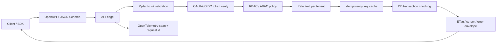

# Production API and Backend Patterns

> Topic package — Week 04+ · Roadmap Week 04+ — Production API and Backend Patterns.
> Depth goal: design and implement production API/backend patterns that enterprise teams actually rely on: OpenAPI-first contracts, Pydantic validation, OAuth2/OIDC token boundaries, idempotent writes, cursor pagination, conditional requests, rate limits, retry discipline, tracing, and database concurrency controls.

## Source
- Track: Software Engineering (self-directed, FDE roadmap)
- Slide deck: `07 Resources Library/Software Engineering/Slides/Lesson_08_Production_API_and_Backend_Patterns.pptx`
- Hands-on notebook: `07 Resources Library/Software Engineering/Notebooks/08_Production_API_and_Backend_Patterns.ipynb` (runs offline)
- Reference reading: RFC 9110 HTTP Semantics; RFC 6749 OAuth2; RFC 7636 PKCE; OpenID Connect Core; RFC 7519 JWT; OpenAPI 3.1 and JSON Schema; Stripe idempotency keys; Google API Improvement Proposals; OpenTelemetry specification; PostgreSQL transaction isolation docs; FastAPI and Pydantic v2 docs
- Builds on: [[02 Literature Notes/Software Engineering/APIs, Integration & Backend Engineering]]
- Date: 2026-07-18

---

## 1. Mental Model

**A production API is a contract plus a control plane.** The contract defines schemas, status codes, auth requirements, pagination, idempotency, concurrency rules, and error envelopes. The control plane enforces tokens, scopes, rate limits, retries, tracing, transactions, and tenant isolation. Real teams ship both; a pretty route handler without these controls is not production-ready.

Backend reliability comes from making ambiguity impossible. OpenAPI and JSON Schema say what crosses the boundary. Pydantic v2 validates it. OAuth2/OIDC and JWT/opaque tokens state who is calling and for what audience/scope. Idempotency keys make retries safe. Cursors and ETags protect databases and state transitions. Traces and request ids let teams debug the distributed path.

> Key intuition: **treat every endpoint as a small distributed system boundary: validate, authenticate, authorize, rate-limit, transact, observe, and make retries safe.**



---

## 2. How It Actually Works

### 4+.1 Contract-first design and validation
OpenAPI-first means the schema is designed before or alongside implementation, then used for server validation, SDK generation, examples, and contract tests. OpenAPI 3.1 aligns with JSON Schema, so request/response models can express enums, numeric ranges, nullable fields, object shapes, and examples. The named production pattern is **contract-driven development**: client and server teams agree on the artifact, then test against it in CI.

Pydantic v2 belongs at the API boundary. Use `BaseModel`, `Field` constraints, `model_config = ConfigDict(extra='forbid')`, and separate request/response models so database rows do not leak. Validation failure should produce a stable `422` envelope; do not let random Python exceptions become the client contract.

### 4+.2 OAuth2, OIDC, JWTs, opaque tokens, and authorization
OAuth2 is authorization delegation; OIDC layers identity on top with ID tokens and user claims. Authorization Code + PKCE is the standard browser/native user flow because the code exchange is protected by a verifier; Client Credentials is the machine-to-machine flow for services and batch jobs. Implementation depth means checking issuer, audience, expiry, signature, scopes, tenant binding, and key rotation — not merely decoding a token.

JWTs are self-contained and fast to verify but hard to revoke before expiry; opaque tokens require introspection/cache but centralize revocation. Refresh-token rotation detects replay by invalidating the previous refresh token when a new one is issued. RBAC maps principals to roles; ABAC evaluates attributes such as tenant, region, document classification, and purpose. Enterprise APIs usually need both.

### 4+.3 Safe writes, pagination, caching semantics, and rate limits
The Stripe-style **Idempotency-Key** pattern stores the first response for a retryable write keyed by tenant + method + path + body hash + key. Replays return the original response; mismatched bodies with the same key return `409`. This prevents double LLM job submission, duplicate payments, and repeated ingestion requests when clients retry after timeouts.

Offset pagination is easy but degrades as offsets grow and can skip/duplicate rows under concurrent writes. Cursor pagination uses an opaque cursor over a stable order such as `(created_at, id)` and is the default for event feeds, embedding search results, and large tenant resources. ETags support `If-None-Match` for cache revalidation and `If-Match` for optimistic concurrency; `412 Precondition Failed` is better than lost updates. Rate limits should be per API key or tenant and return `X-RateLimit-Limit`, `X-RateLimit-Remaining`, and `X-RateLimit-Reset`.

### 4+.4 Retries, backoff, jitter, and tracing
Clients should retry only retryable failures: `429`, `503`, some `502/504`, connection resets, and explicitly documented transient errors. Do not retry validation errors, authorization failures, or non-idempotent writes without an idempotency key. Exponential backoff with **full jitter** avoids synchronization: sleep is random between `0` and `min(cap, base * 2^attempt)`. Production SDKs also respect `Retry-After`.

Distributed tracing gives every request a path: edge span, auth span, DB span, model span, vector-search span, and downstream SDK spans. OpenTelemetry attributes should include tenant id, route, status code, retry attempt, model/job id where safe, and request id. For AI systems, tracing is how you debug a slow RAG answer across retrieval, rerank, prompt construction, model call, and post-processing.

### 4+.5 Database performance and concurrency controls
N+1 queries happen when a handler fetches a list and then queries children one row at a time; with 50 rows and a 20-connection pool, one request can consume the pool and amplify latency. Fix with joins, select-in loading, batching, or precomputed read models. Connection pooling must match DB capacity, app concurrency, and transaction duration; bigger pools can make an overloaded DB worse.

Transactions need isolation choices. Read Committed is common and fast but can allow lost updates without version checks. Repeatable Read prevents some anomalies but may still require retry logic depending on database. Serializable gives the strongest abstraction at higher abort/retry cost. Optimistic locking uses a version column plus `WHERE id=? AND version=?`; pessimistic locking uses row locks when conflicts are expected and work must be serialized.

---

## 3. Implementation

Assumed stack: FastAPI, Pydantic v2, PyJWT, SQLAlchemy, httpx-compatible TestClient, and OpenTelemetry SDK, all used offline in-process. Snippets:
- [[04 Code Snippets/Software Engineering/SE Week 04+ FastAPI JWT Rate Limit Idempotency Demo]]
- [[04 Code Snippets/Software Engineering/SE Week 04+ OpenTelemetry Retry With Jitter Demo]]

### SE Week 04+ FastAPI JWT Rate Limit Idempotency Demo
A real in-process FastAPI app using Pydantic v2 models, JWT auth, tenant rate limits, and an Idempotency-Key middleware exercised by TestClient.
```python
import json, time
from fastapi import Depends, FastAPI, Header, HTTPException, Request
from fastapi.responses import JSONResponse, Response
from fastapi.security import HTTPAuthorizationCredentials, HTTPBearer
from fastapi.testclient import TestClient
from pydantic import BaseModel, ConfigDict, Field
import jwt

SECRET = 'dev-secret'
AUDIENCE = 'llm-jobs-api'
app = FastAPI(title='Production API Demo')
bearer = HTTPBearer()
idempotency_store = {}
rate_state = {}

class JobCreate(BaseModel):
    model_config = ConfigDict(extra='forbid')
    prompt: str = Field(min_length=1, max_length=500)
    tenant_id: str = Field(pattern='^[a-z0-9-]+$')

class JobOut(BaseModel):
    job_id: str
    status: str

async def principal(creds: HTTPAuthorizationCredentials = Depends(bearer)):
    try:
        claims = jwt.decode(creds.credentials, SECRET, algorithms=['HS256'], audience=AUDIENCE)
    except jwt.PyJWTError as exc:
        raise HTTPException(401, 'invalid token') from exc
    if 'jobs:write' not in claims.get('scope', '').split():
        raise HTTPException(403, 'missing jobs:write')
    return claims

async def rate_limit(claims=Depends(principal)):
    tenant = claims['tenant']
    limit = 3
    used = rate_state.get(tenant, 0)
    if used >= limit:
        raise HTTPException(429, 'rate limited', headers={'X-RateLimit-Limit': str(limit), 'X-RateLimit-Remaining': '0'})
    rate_state[tenant] = used + 1
    return claims

@app.middleware('http')
async def idempotency(request: Request, call_next):
    key = request.headers.get('Idempotency-Key')
    if request.method != 'POST' or not key:
        return await call_next(request)
    body = await request.body()
    cache_key = (request.url.path, key, body)
    if cache_key in idempotency_store:
        status, headers, payload = idempotency_store[cache_key]
        return JSONResponse(payload, status_code=status, headers={**headers, 'Idempotency-Replayed': 'true'})
    response = await call_next(request)
    chunks = [chunk async for chunk in response.body_iterator]
    payload = json.loads(b''.join(chunks) or b'{}')
    idempotency_store[cache_key] = (response.status_code, dict(response.headers), payload)
    return JSONResponse(payload, status_code=response.status_code, headers=dict(response.headers))

@app.post('/jobs', response_model=JobOut, status_code=202)
def create_job(req: JobCreate, claims=Depends(rate_limit)):
    if req.tenant_id != claims['tenant']:
        raise HTTPException(403, 'wrong tenant')
    return JobOut(job_id='job-1', status='queued')

token = jwt.encode({'sub': 'svc-1', 'tenant': 'acme', 'aud': AUDIENCE, 'scope': 'jobs:write', 'exp': int(time.time()) + 300}, SECRET, algorithm='HS256')
client = TestClient(app)
headers = {'Authorization': f'Bearer {token}', 'Idempotency-Key': 'abc'}
print(client.post('/jobs', json={'prompt':'index docs','tenant_id':'acme'}, headers=headers).json())
print(client.post('/jobs', json={'prompt':'index docs','tenant_id':'acme'}, headers=headers).headers.get('Idempotency-Replayed'))
```

### SE Week 04+ OpenTelemetry Retry With Jitter Demo
An in-process client shows exponential backoff with jitter across simulated 429/503 responses and captures spans locally.
```python
import random
from opentelemetry import trace
from opentelemetry.sdk.trace import TracerProvider
from opentelemetry.sdk.trace.export import SimpleSpanProcessor
from opentelemetry.sdk.trace.export.in_memory_span_exporter import InMemorySpanExporter

exporter = InMemorySpanExporter()
provider = TracerProvider()
provider.add_span_processor(SimpleSpanProcessor(exporter))
tracer = provider.get_tracer('retry-demo')

class FakeAPI:
    def __init__(self, statuses): self.statuses = list(statuses)
    def get(self): return self.statuses.pop(0) if self.statuses else 200

def call_with_retry(api, max_attempts=4, base=0.05, cap=1.0, rng=random.Random(4)):
    delays = []
    with tracer.start_as_current_span('client.request') as root:
        for attempt in range(max_attempts):
            with tracer.start_as_current_span('attempt') as span:
                status = api.get()
                span.set_attribute('http.status_code', status)
                span.set_attribute('retry.attempt', attempt)
                if status < 500 and status != 429:
                    root.set_attribute('final.status_code', status)
                    return status, delays
            if status not in (429, 502, 503, 504):
                return status, delays
            delays.append(rng.uniform(0, min(cap, base * (2 ** attempt))))
    return status, delays

status, delays = call_with_retry(FakeAPI([429, 503, 200]))
print(status, [round(d, 3) for d in delays], len(exporter.get_finished_spans()))
```

---

## 4. Design Decisions & Tradeoffs

| Decision | Guidance |
|---|---|
| **OpenAPI-first vs code-first** | Use OpenAPI-first when multiple teams or generated clients depend on the contract; code-first is acceptable only if CI publishes and diff-checks the generated spec. |
| **JWT vs opaque token** | Use JWT for low-latency local verification with short expiries and strict audience; use opaque tokens when central revocation and dynamic policy are more important. |
| **RBAC vs ABAC** | Use RBAC for coarse human-readable roles; add ABAC for tenant, resource classification, environment, purpose, and data-residency conditions. |
| **Cursor vs offset pagination** | Use offset for small admin tables; use opaque cursors over stable ordering for large mutable datasets and embedding/search result pagination. |
| **Optimistic vs pessimistic locking** | Use version-column optimistic locking when conflicts are rare; use pessimistic locks when conflicts are frequent and duplicate side effects are unacceptable. |
| **Retry policy** | Retry only documented transient errors with exponential backoff and jitter; require idempotency keys for retryable writes. |

---

## 5. Failure Modes & Gotchas

- Unbounded pagination or `limit=100000` list endpoints → table scans, memory spikes, and database saturation.
- Accepting JWTs without verifying algorithm, issuer, audience, expiry, and scopes — including historical `none` algorithm mistakes → account or tenant compromise.
- Client retries POST requests after a timeout without Idempotency-Key → duplicate LLM jobs, charges, emails, or ingestion runs.
- Retrying every 429/503 immediately from many clients → synchronized retry storm that extends the outage.
- N+1 queries inside list endpoints → connection pool exhaustion and p99 latency cliffs under normal traffic.
- Read Committed update flows without version checks or locks → lost updates when two clients edit the same resource.

---

## 6. FDE Angle

- Enterprise AI tool-calling endpoints need JWT audiences and scopes so agents can call only approved tools for the right tenant and environment.
- LLM job submission should use Idempotency-Key and `202 + job_id`; otherwise notebook retries and flaky networks create duplicate expensive work.
- Cursor pagination over embedding search results and audit logs prevents deep-offset database pain and gives stable resumable client workflows.
- OpenTelemetry request ids and spans across ingestion, vector search, rerank, prompt assembly, model call, and post-processing are essential for debugging RAG incidents with customers.

---

## 7. Self-Check

1. What additional identity guarantee does OIDC add on top of OAuth2?
2. Why must JWT verification include audience, expiry, issuer, algorithm, and scopes?
3. How does an Idempotency-Key prevent duplicate write side effects after a timeout?
4. Why does cursor pagination beat offset pagination for large mutable datasets?
5. When should an API return `412 Precondition Failed` with ETags?
6. How do exponential backoff and jitter prevent retry storms?

## 8. Links
- Domain MOC: [[06 Maps of Content/Software Engineering Concepts]]
- Code: [[04 Code Snippets/Software Engineering/SE Week 04+ FastAPI JWT Rate Limit Idempotency Demo]], [[04 Code Snippets/Software Engineering/SE Week 04+ OpenTelemetry Retry With Jitter Demo]]
- Distilled: [[03 Permanent Notes/SE Week 04+ Production API Design Checklist]], [[03 Permanent Notes/SE Week 04+ OAuth2 OIDC and Token Patterns]]
- Upstream: [[02 Literature Notes/Software Engineering/APIs, Integration & Backend Engineering]] · Downstream: [[06 Maps of Content/Software Engineering Concepts]]
