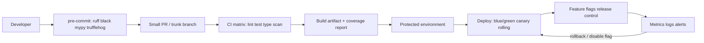

# Production Delivery Engineering

> Topic package — Week 01+ · Roadmap Week 01+ — Production Delivery Engineering.
> Depth goal: design production delivery systems that make every change traceable, testable, releasable, observable, and reversible: CI/CD pipelines, pre-commit gates, branch strategy, versioning, security scanning, feature flags, contracts, and rollout patterns.

## Source
- Track: Software Engineering (self-directed, FDE roadmap)
- Slide deck: `07 Resources Library/Software Engineering/Slides/Lesson_05_Production_Delivery_Engineering.pptx`
- Hands-on notebook: `07 Resources Library/Software Engineering/Notebooks/05_Production_Delivery_Engineering.ipynb` (runs offline)
- Reference reading: Accelerate (Forsgren/Humble/Kim); Continuous Delivery (Humble/Farley); GitHub Actions documentation; pre-commit, ruff, black, mypy, pytest-cov, mutmut, Bandit, pip-audit docs; OpenFeature and LaunchDarkly architecture notes; Pact documentation; Release Please documentation
- Builds on: [[02 Literature Notes/Software Engineering/Software Engineering Refresh]]
- Date: 2026-07-18

---

## 1. Mental Model

**Production delivery engineering is a risk-reduction system, not a YAML hobby.** The pipeline should answer four questions on every change: is the code understandable, is the behavior proven, is the artifact reproducible, and can the rollout be stopped or reversed without heroic manual work?

Mature teams separate **deploy** from **release**. They build once, scan once, attach provenance, promote the same artifact through environments, and expose functionality with feature flags or progressive rollout. Git workflow, pre-commit hooks, CI checks, semantic versions, changelogs, coverage gates, SAST/SCA, contract tests, and deployment strategies are all controls in one socio-technical system.

> Key intuition: **optimize for small, boring, reversible changes** — the best delivery system makes the safe path the fastest path.



---

## 2. How It Actually Works

### 1+.1 CI/CD pipelines are executable policy
A useful GitHub Actions pipeline runs the same categories of checks developers run locally, but with production constraints: pinned action versions, `permissions: contents: read`, Python matrix builds such as 3.11 and 3.12, dependency caching keyed on the lockfile, uploaded coverage and build artifacts, and protected `environment` gates for staging/production. Required branch checks should include format/lint, type check, unit/integration tests, security scan, and artifact build.

Real tradeoff: every check has a feedback-loop cost. Put sub-10-second formatting and obvious secret checks in pre-commit; keep PR CI under roughly 10 minutes for normal services; move slow mutation or full e2e suites to nightly or pre-release unless they protect critical revenue paths.

### 1+.2 Pre-commit, coverage, mutation, and security gates
A production Python repo commonly uses pre-commit hooks for `ruff`, `black`, `mypy`, and `trufflehog` secret scanning before code leaves the laptop. CI then repeats critical checks in a clean environment and adds `pytest --cov --cov-fail-under=80`, `bandit -r src`, `pip-audit`, and dependency automation with Dependabot or Renovate.

Coverage is a guardrail, not a goal: 85% line coverage with no assertions can still miss the failure. Mutation testing with `mutmut` measures whether tests detect changed behavior, but it is CPU-expensive; teams often run it on core domain modules nightly or before high-risk releases rather than on every PR.

### 1+.3 Branching, PR size, versioning, and changelogs
Trunk-based development wins when teams can keep branches short-lived, behind flags, and continuously integrated. A practical rule is PRs under about 300-500 changed lines, merged within 24-48 hours, with one behavioral concern per PR. GitFlow can still win for packaged products, regulated release trains, or long-lived supported versions where release branches carry backports.

Semantic versioning and Conventional Commits turn history into release automation: `feat:` increments minor, `fix:` increments patch, `BREAKING CHANGE:` increments major. Release Please-style automation opens a release PR containing the changelog and version bump, so humans review release notes instead of hand-editing them at 5 p.m.

### 1+.4 Decouple deploy from release with flags and contracts
Feature flags let teams deploy dormant code and release to 1%, 10%, one tenant, or internal users after the artifact is already live. LaunchDarkly-style systems need stable flag keys, typed variations, percentage rollout based on deterministic user hashing, kill switches, audit logs, and cleanup deadlines; stale flags become a hidden distributed configuration system.

Contract testing complements flags when multiple teams ship independently. Pact-style consumer-driven contracts pin what each consumer actually relies on, catching provider changes before deployment. Use contracts for service boundaries and public APIs; do not confuse them with full end-to-end tests of every path.

### 1+.5 Repo topology and deployment strategies
Monorepos centralize atomic refactors, shared tooling, and visibility but require build graph discipline and ownership boundaries; polyrepos give autonomy and smaller blast radius but make cross-service changes, dependency upgrades, and governance harder. Enterprise teams often choose monorepo for tightly-coupled product surfaces and polyrepo for independently governed platforms.

Deployment strategy should match risk. Rolling deploys are simple for stateless services. Blue/green gives fast rollback at 2x capacity cost. Canary deploys expose 1-5% first and require metrics good enough to auto-abort. Feature-flag rollouts control behavior while the deploy mechanism controls bits; both need dashboards and rollback owners.

---

## 3. Implementation

Assumed stack: Python stdlib only. Snippets model real delivery controls offline: a GitHub Actions workflow string with structural validation, and deterministic feature-flag rollout hashing. Snippets:
- [[04 Code Snippets/Software Engineering/SE Week 01+ GitHub Actions Delivery Workflow Validator]]
- [[04 Code Snippets/Software Engineering/SE Week 01+ Deterministic Feature Flag Rollout Evaluator]]

### SE Week 01+ GitHub Actions Delivery Workflow Validator
Embed a realistic GitHub Actions workflow as a Python string and validate required production controls without network access.
```python
import re

GITHUB_ACTIONS_WORKFLOW = '''
name: ci
on:
  pull_request:
  push:
    branches: [main]
permissions:
  contents: read
jobs:
  test:
    runs-on: ubuntu-latest
    strategy:
      matrix:
        python-version: ['3.11', '3.12']
    steps:
      - uses: actions/checkout@v4
      - uses: actions/setup-python@v5
        with:
          python-version: ${{ matrix.python-version }}
          cache: pip
      - run: python -m pip install -r requirements.txt -r requirements-dev.txt
      - run: ruff check . && black --check . && mypy src
      - run: pytest --cov=src --cov-fail-under=85 --junitxml=reports/junit.xml
      - run: bandit -r src && pip-audit
      - uses: actions/upload-artifact@v4
        with:
          name: test-reports-${{ matrix.python-version }}
          path: reports/
  deploy-staging:
    needs: test
    runs-on: ubuntu-latest
    environment: staging
    steps:
      - run: echo deploy immutable artifact to staging
'''

REQUIRED_PATTERNS = {
    "least_privilege_permissions": r"permissions:\s*\n\s*contents: read",
    "matrix_python": r"matrix:\s*\n\s*python-version:.*3\.11.*3\.12",
    "dependency_cache": r"cache: pip",
    "coverage_gate": r"--cov-fail-under=85",
    "sast_sca": r"bandit -r src && pip-audit",
    "artifact_upload": r"actions/upload-artifact@v4",
    "protected_environment": r"environment: staging",
}

def validate_workflow(text):
    missing = [name for name, pattern in REQUIRED_PATTERNS.items()
               if not re.search(pattern, text, flags=re.S)]
    return {"ok": not missing, "missing": missing, "lines": len(text.splitlines())}

print(validate_workflow(GITHUB_ACTIONS_WORKFLOW))
```

### SE Week 01+ Deterministic Feature Flag Rollout Evaluator
A LaunchDarkly-style percentage rollout evaluator using stable SHA-256 buckets, tenant targeting, and kill-switch behavior.
```python
from dataclasses import dataclass, field
import hashlib

@dataclass(frozen=True)
class FeatureFlag:
    key: str
    enabled: bool
    rollout_percent: int = 0
    allow_tenants: set[str] = field(default_factory=set)
    deny_users: set[str] = field(default_factory=set)

def bucket(flag_key, user_id, salt="prod"):
    digest = hashlib.sha256(f"{salt}:{flag_key}:{user_id}".encode()).hexdigest()
    return int(digest[:8], 16) % 100

def evaluate(flag, user_id, tenant_id):
    if not flag.enabled or user_id in flag.deny_users:
        return False
    if tenant_id in flag.allow_tenants:
        return True
    return bucket(flag.key, user_id) < flag.rollout_percent

flag = FeatureFlag("llm_answer_v2", enabled=True, rollout_percent=25, allow_tenants={"acme"})
for user, tenant in [("u1", "acme"), ("u2", "beta"), ("u3", "beta"), ("u4", "beta")]:
    print(user, tenant, bucket(flag.key, user), evaluate(flag, user, tenant))
```

---

## 4. Design Decisions & Tradeoffs

| Decision | Guidance |
|---|---|
| **Trunk-based vs GitFlow** | Use trunk-based for SaaS/AI services with flags, short branches, and continuous deploy; use GitFlow or release branches for packaged clients, regulated release trains, and maintained older versions. |
| **Required checks** | Make GitHub branch protection require ruff/black, mypy, pytest with pytest-cov, Bandit, pip-audit, and artifact build; keep mutmut nightly unless the changed package is safety-critical. |
| **Version automation** | Use Conventional Commits plus Release Please for libraries and APIs; for internal apps still tag deployable artifacts with commit SHA and changelog links. |
| **Dependency automation** | Use Dependabot for GitHub-native simplicity or Renovate for monorepo grouping, schedules, and custom managers; require CI green before auto-merge. |
| **Monorepo vs polyrepo** | Choose monorepo with Bazel/Nx/Turborepo-style affected builds for shared platform work; choose polyrepo when service ownership, compliance, and independent lifecycle dominate. |
| **Rollout mechanism** | Use blue/green when rollback speed matters and 2x capacity is acceptable; use canary with SLO metrics for high-traffic services; use flags for tenant/user release control. |

---

## 5. Failure Modes & Gotchas

- CI installs floating dependencies and deploys from the working tree → non-reproducible artifact during rollback.
- Required checks omit secret scanning → a token reaches GitHub history and must be rotated under incident pressure.
- Coverage gate rises to 90% but mutation score stays near zero → tests execute lines without verifying behavior.
- Long-lived branches merge after two weeks → integration conflict, duplicated migrations, and a Friday release freeze.
- Feature flag is left permanent with no owner or expiry → every future change must reason about dead production branches.
- Canary has no business/SLO guardrail → bad release reaches 100% because only container health was monitored.

---

## 6. FDE Angle

- Enterprise AI deployments need repeatable delivery because client security teams will ask exactly what code, model config, prompt version, and dependency set is running.
- Feature flags let an FDE deploy an LLM workflow once, then enable it for one pilot tenant, internal reviewers, or 5% of users without redeploying.
- SAST/SCA and secret scanning catch the boring risks around AI apps: leaked API keys, vulnerable parsers, unsafe deserialization, and stale transitive dependencies.
- Contract tests protect integrations with client systems and LLM tool APIs when retries, schema changes, or provider migrations happen under deadline.

---

## 7. Self-Check

1. Which checks belong in pre-commit, PR CI, nightly CI, and protected deployment environments?
2. Why does build-once/promote-many reduce rollback and audit risk?
3. When does GitFlow beat trunk-based development despite slower integration?
4. What makes a coverage gate misleading, and how does mutation testing change the signal?
5. How do feature flags decouple deploy from release, and what operational debt do they create?
6. Which deployment strategy would you choose for a stateful service versus a stateless API?

## 8. Links
- Domain MOC: [[06 Maps of Content/Software Engineering Concepts]]
- Code: [[04 Code Snippets/Software Engineering/SE Week 01+ GitHub Actions Delivery Workflow Validator]], [[04 Code Snippets/Software Engineering/SE Week 01+ Deterministic Feature Flag Rollout Evaluator]]
- Distilled: [[03 Permanent Notes/SE Week 01+ CI CD Pipeline Design Checklist]], [[03 Permanent Notes/SE Week 01+ Deployment Strategies Decision Guide]]
- Upstream: [[02 Literature Notes/Software Engineering/Software Engineering Refresh]] · Downstream: [[02 Literature Notes/Software Engineering/System Design Fundamentals]]
