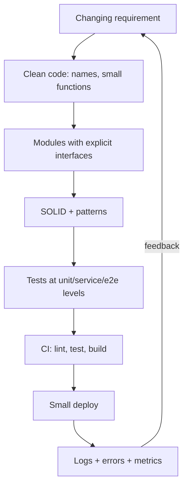

# Software Engineering Refresh

> Topic package — Week 01 · Roadmap Week 01 — Software Engineering Refresh.
> Depth goal: refresh the engineering fundamentals that make AI/FDE systems maintainable: small interfaces, clear boundaries, reliable error paths, observable behavior, intentional tests, and disciplined delivery.

## Source
- Track: Software Engineering (self-directed, FDE roadmap)
- Slide deck: `07 Resources Library/Software Engineering/Slides/Lesson_01_Software_Engineering_Refresh.pptx`
- Hands-on notebook: `07 Resources Library/Software Engineering/Notebooks/01_Software_Engineering_Refresh.ipynb` (runs offline)
- Reference reading: Clean Code (Martin); Design Patterns (Gamma et al.); Refactoring (Fowler); Accelerate (Forsgren/Humble/Kim); Google SRE Workbook; pytest and GitHub Actions documentation
- Date: 2026-07-18

---

## 1. Mental Model

**Software engineering is the discipline of making change safe.** Clean code reduces local cognitive load; SOLID and patterns reduce coupling; modular architecture contains blast radius; tests, logs, git, and CI/CD create fast feedback loops so teams can ship confidently.

For an AI Forward Deployed Engineer, fundamentals matter because demos become production faster than expected. A prototype that mixes domain logic, vendor calls, configuration, and logging will be impossible to debug at a client site. A small set of boring practices — dependency inversion, structured errors, contract tests, and trunk-based delivery — keeps the system adaptable when requirements move.

> Key intuition: **optimize for reversible, observable change** — code should reveal intent, isolate policy from mechanics, fail loudly with context, and prove its behavior automatically.



---

## 2. How It Actually Works

### 1.1 Clean code is about preserving intent
Clean code is not aesthetic minimalism; it is code whose **reason for existing** survives the next edit. Prefer domain names over implementation names, short functions with one level of abstraction, explicit return values over hidden mutation, and early exits over deeply nested control flow. Comments should explain non-obvious *why*, not restate the *what*.

The senior tradeoff is knowing when abstraction pays rent. Duplication across two call sites is often cheaper than a premature framework; duplication across policy decisions is dangerous because it lets business rules diverge. Refactor toward concepts the domain already has: `InvoicePolicy`, `RetryBudget`, `DocumentChunker`, not `ManagerHelperUtil`.

### 1.2 SOLID as change-containment rules
SOLID is useful when treated as a set of pressure gauges rather than dogma. **Single Responsibility** asks: what kind of change should force this module to change? **Open/Closed** says new variants should be added by extension when variants are frequent. **Liskov** protects substitutability: tests for a port should pass for every adapter. **Interface Segregation** prevents clients from depending on methods they do not use. **Dependency Inversion** keeps domain policy independent from infrastructure.

In FDE work, DIP is the highest leverage: put client/vendor/database details behind ports so a demo using in-memory data can become a production integration without rewriting the core workflow.

### 1.3 Patterns and modular architecture
Design patterns are names for recurring tradeoffs. Strategy handles interchangeable policies; Adapter wraps external APIs; Factory centralizes construction; Facade simplifies a subsystem; Observer/Event Bus decouples producers from consumers. Use a pattern when it makes a future change path explicit, not because patterns are fashionable.

Modular architecture means each module owns a coherent slice: domain model, application/service orchestration, infrastructure adapters, and presentation/API. Dependencies should point inward toward stable policy. If a domain object imports HTTP clients, cloud SDKs, or UI code, the boundary has leaked and tests will become slow, brittle, and hard to reason about.

### 1.4 Error handling, logging, and observability
Good systems distinguish expected domain failures from programmer bugs and infrastructure faults. Return typed results or raise domain-specific exceptions at boundaries; preserve original exceptions with chaining; add context once at the boundary where you know request/user/job identifiers. Avoid broad `except Exception: pass`, boolean success flags with no reason, and logs that cannot be joined across a request.

Structured logging is the minimum viable observability layer. Emit stable event names plus fields (`request_id`, `customer_id`, `operation`, `duration_ms`, `error_type`) instead of prose-only strings. A future incident response should answer: what failed, for whom, how often, and after which dependency call?

### 1.5 Testing, git workflow, and CI/CD
A practical test strategy is a portfolio. Unit tests pin pure rules and edge cases; integration tests verify adapters and persistence; contract tests protect module/API boundaries; a small number of end-to-end tests cover critical journeys. The testing pyramid is really a feedback-speed pyramid: most tests should be fast enough to run locally on every change.

Use small branches or trunk-based development, meaningful commits, pull requests that isolate one concern, and CI that runs the same commands developers run locally. CD basics are equally boring: build once, promote artifacts, keep configuration outside code, migrate safely, deploy small, and roll back quickly. The goal is not process ceremony; it is reducing the cost of being wrong.

---

## 3. Implementation

Assumed stack: Python stdlib only. Snippets show SOLID/pattern boundaries and production-grade error/logging shape without external services. Snippets:
- [[04 Code Snippets/Software Engineering/SE Week 01 SOLID Strategy Boundary Example]]
- [[04 Code Snippets/Software Engineering/SE Week 01 Structured Logging and Error Boundary]]

### SE Week 01 SOLID Strategy Boundary Example
A small Strategy + Dependency Inversion example: domain pricing depends on a policy interface, not vendor/infrastructure code.
```python
from dataclasses import dataclass
from typing import Protocol

@dataclass(frozen=True)
class Order:
    customer_tier: str
    subtotal_cents: int

class DiscountPolicy(Protocol):
    def discount_cents(self, order: Order) -> int: ...

class TierDiscount:
    def __init__(self, rates):
        self.rates = rates
    def discount_cents(self, order):
        return int(order.subtotal_cents * self.rates.get(order.customer_tier, 0.0))

class NoDiscount:
    def discount_cents(self, order):
        return 0

class Pricer:
    def __init__(self, policy: DiscountPolicy):
        self.policy = policy          # depends on abstraction, not concrete vendor logic
    def total_cents(self, order):
        discount = self.policy.discount_cents(order)
        if discount < 0 or discount > order.subtotal_cents:
            raise ValueError("invalid discount policy result")
        return order.subtotal_cents - discount

order = Order(customer_tier="gold", subtotal_cents=10_000)
print(Pricer(TierDiscount({"gold": 0.15})).total_cents(order))
print(Pricer(NoDiscount()).total_cents(order))
```

### SE Week 01 Structured Logging and Error Boundary
Wrap an application boundary with typed errors, exception chaining, and structured JSON logs.
```python
import json, logging, sys

class PaymentDeclined(Exception):
    pass

class GatewayUnavailable(Exception):
    pass

logger = logging.getLogger("checkout")
logger.setLevel(logging.INFO)
handler = logging.StreamHandler(sys.stdout)
handler.setFormatter(logging.Formatter("%(message)s"))
logger.handlers[:] = [handler]

def log_event(event, **fields):
    logger.info(json.dumps({"event": event, **fields}, sort_keys=True))

def charge_gateway(amount_cents):
    if amount_cents <= 0:
        raise PaymentDeclined("amount must be positive")
    if amount_cents == 503:
        raise TimeoutError("gateway timed out")
    return {"auth_code": "OK123"}

def checkout(request_id, amount_cents):
    try:
        result = charge_gateway(amount_cents)
        log_event("checkout.succeeded", request_id=request_id, amount_cents=amount_cents)
        return result
    except PaymentDeclined:
        log_event("checkout.declined", request_id=request_id, amount_cents=amount_cents)
        raise
    except TimeoutError as exc:
        log_event("checkout.gateway_unavailable", request_id=request_id, error_type=type(exc).__name__)
        raise GatewayUnavailable("payment gateway unavailable") from exc

print(checkout("req-1", 2500))
try:
    checkout("req-2", 503)
except GatewayUnavailable as exc:
    print(type(exc).__name__, "caused by", type(exc.__cause__).__name__)
```

---

## 4. Design Decisions & Tradeoffs

| Decision | Guidance |
|---|---|
| **Abstraction timing** | Abstract around stable domain seams or frequent variation; do not build generic frameworks before the second or third concrete use case proves the shape. |
| **Dependency direction** | Keep domain/application policy independent from UI, storage, network, and vendor SDKs; adapters depend inward, not the reverse. |
| **Pattern selection** | Use Strategy for interchangeable policies, Adapter for external systems, Factory for construction, and Facade for subsystem simplification; avoid pattern stacking that hides simple control flow. |
| **Error surface** | Expose domain errors to callers, wrap infrastructure failures at boundaries, and preserve causes with exception chaining for debugging. |
| **Test mix** | Bias toward fast unit and contract tests; add integration tests for adapters and only a few high-value end-to-end flows. |
| **Delivery workflow** | Prefer small PRs, trunk-friendly branches, CI on every change, build-once artifacts, feature flags, and rollback plans over big-bang releases. |

---

## 5. Failure Modes & Gotchas

- Treating SOLID as ceremony → many tiny interfaces with no actual change pressure.
- Letting domain logic import HTTP clients, databases, or vendor SDKs → slow tests and expensive rewrites.
- Catching broad exceptions and returning `None` → lost root cause and silent data corruption.
- Logging prose without stable fields → incidents cannot be grouped by customer, request, or dependency.
- An inverted test pyramid with mostly brittle UI/e2e tests → slow feedback and ignored red builds.
- Long-lived branches and manual deploy steps → integration surprises, unreproducible releases, and rollback panic.

---

## 6. FDE Angle

- Client deployments move through unknowns quickly; clean boundaries let you swap a mock, CSV, SaaS API, or on-prem connector without rewriting core policy.
- A client-facing AI workflow needs auditability: structured logs, typed errors, and testable contracts are how you explain behavior under pressure.
- The FDE deliverable is rarely just code; it is a maintainable slice with tests, CI, runbook-quality logs, and a safe path to iterate with users.
- When an LLM integration fails, software fundamentals decide whether you can isolate prompt, data, vendor, orchestration, or deployment causes in minutes instead of days.

---

## 7. Self-Check

1. What kind of change should force a module to change, and how does that relate to Single Responsibility?
2. Where should dependencies point in a layered or hexagonal codebase?
3. When would Strategy be better than a long `if/elif` chain?
4. How do you preserve root cause while exposing a clean application error?
5. What belongs in unit, integration, contract, and end-to-end tests?
6. What should CI prove before a change is merged or deployed?

## 8. Links
- Domain MOC: [[06 Maps of Content/Software Engineering Concepts]]
- Code: [[04 Code Snippets/Software Engineering/SE Week 01 SOLID Strategy Boundary Example]], [[04 Code Snippets/Software Engineering/SE Week 01 Structured Logging and Error Boundary]]
- Distilled: [[03 Permanent Notes/SE Week 01 SOLID Principles Quick Reference]], [[03 Permanent Notes/SE Week 01 Testing Pyramid and Delivery Strategy]]
- Upstream: [[06 Maps of Content/Software Engineering Concepts]] · Downstream: [[02 Literature Notes/Software Engineering/System Design Fundamentals]]
