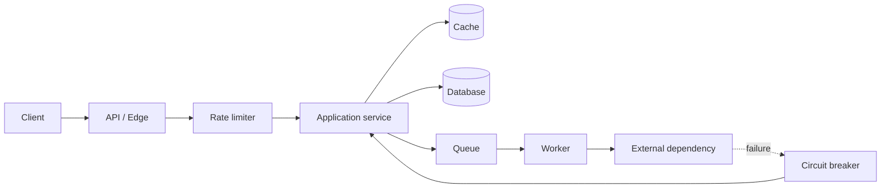

# System Design Fundamentals

> Topic package — Week 02 · Roadmap Week 02 — System Design Fundamentals.
> Depth goal: reason about system design fundamentals with practical tradeoffs: request flow, boundaries, service decomposition, eventing, queues, caching, rate limiting, scalability, reliability, and fault tolerance.

## Source
- Track: Software Engineering (self-directed, FDE roadmap)
- Slide deck: `07 Resources Library/Software Engineering/Slides/Lesson_02_System_Design_Fundamentals.pptx`
- Hands-on notebook: `07 Resources Library/Software Engineering/Notebooks/02_System_Design_Fundamentals.ipynb` (runs offline)
- Reference reading: Designing Data-Intensive Applications (Kleppmann); Release It! (Nygard); Google SRE Book; Enterprise Integration Patterns; AWS Well-Architected Reliability Pillar; Martin Fowler articles on microservices and hexagonal architecture
- Builds on: [[02 Literature Notes/Software Engineering/Software Engineering Refresh]]
- Date: 2026-07-18

---

## 1. Mental Model

**System design is controlled tradeoff management under load and failure.** A useful design names the boundary of each component, the data it owns, the synchronous and asynchronous paths between components, and the behavior when dependencies slow down, fail, or return partial results.

Client-server and layered architectures teach request/response separation; hexagonal architecture protects business policy from transport and persistence; microservices trade independent deployability for distributed-systems complexity; event-driven designs and queues decouple time and load; caching and rate limits buy performance and protection at the cost of consistency and fairness decisions.

> Key intuition: **architecture is where you choose your failure modes** — every cache, queue, service boundary, and retry policy moves latency, consistency, and operational burden somewhere.



---

## 2. How It Actually Works

### 2.1 Client-server, layers, and request flow
Client-server splits consumers from providers: clients express intent over a protocol, servers enforce policy and own data. Layered architecture then separates presentation/API, application orchestration, domain rules, and infrastructure. The benefit is understandable flow and testable seams; the risk is an anemic stack where every change requires plumbing through layers with no real boundary.

Senior design starts with request shape: who calls whom, what is synchronous, what is idempotent, what data is read/written, and what timeout applies. A sequence diagram is often more valuable than a box diagram because it reveals latency accumulation and hidden coupling.

### 2.2 Hexagonal architecture and service boundaries
Hexagonal (ports and adapters) architecture puts domain/application policy at the center and treats HTTP, databases, queues, and vendor APIs as replaceable adapters. Input ports represent use cases; output ports represent capabilities needed by the core. This is especially useful when an FDE prototype starts with local files or mocks and later connects to client systems.

Microservices apply a stronger boundary: each service should own data and deploy independently around a business capability. The trade is real: teams gain autonomy and scaling isolation, but pay with network latency, versioning, observability, retries, distributed transactions, and on-call complexity. If one team owns everything and the database is shared, a modular monolith is often the better first design.

### 2.3 Event-driven architecture, queues, and backpressure
Event-driven systems publish facts that happened (`OrderPaid`, `DocumentIndexed`) so consumers can react without blocking the producer. Queues decouple time: producers enqueue quickly, workers process at their pace, and bursts are smoothed. They also create new responsibilities: idempotent handlers, dead-letter queues, ordering guarantees, retry policy, and visibility into lag.

Events are not remote procedure calls with worse debugging. Use commands when you need a specific service to do something; use events when multiple consumers may independently react to a fact. Design for at-least-once delivery unless the infrastructure proves otherwise; exactly-once claims usually hide idempotency work somewhere else.

### 2.4 Caching, rate limiting, and scalability
Scalability is not only adding machines; it is reducing expensive work and controlling demand. Caches lower latency and backend load, but require key design, TTLs, invalidation, warmup, stampede protection, and correctness rules. Read-through, write-through, write-behind, and cache-aside each move complexity differently.

Rate limiting protects shared resources and creates fair allocation. Token bucket allows bursts while enforcing a long-term rate; leaky bucket smooths traffic; fixed windows are simple but bursty at boundaries. Limits should be observable and product-aware: per user, tenant, API key, route, or downstream dependency, with clear retry-after behavior.

### 2.5 Reliability and fault tolerance
Reliability is the probability the system performs correctly over time; fault tolerance is the ability to keep operating despite component failures. Techniques include timeouts, retries with jitter, circuit breakers, bulkheads, idempotency keys, replication, health checks, graceful degradation, and disaster recovery.

Retries are dangerous without budgets: they can amplify an outage. Timeouts must be shorter than caller deadlines. Circuit breakers prevent repeated calls to a dependency already known to be failing. Graceful degradation should be a product decision: serve cached data, partial answers, queued work, or a clear failure message depending on user value and risk.

---

## 3. Implementation

Assumed stack: Python stdlib only. Snippets simulate rate limiting and caching locally so notebooks execute offline. Snippets:
- [[04 Code Snippets/Software Engineering/SE Week 02 Token Bucket Rate Limiter]]
- [[04 Code Snippets/Software Engineering/SE Week 02 In-Memory LRU Cache]]

### SE Week 02 Token Bucket Rate Limiter
A deterministic token-bucket limiter with simulated timestamps: burst capacity plus sustained refill rate.
```python
from dataclasses import dataclass

@dataclass
class TokenBucket:
    capacity: float
    refill_per_second: float
    tokens: float = 0.0
    updated_at: float = 0.0

    def __post_init__(self):
        self.tokens = self.capacity

    def allow(self, now, cost=1.0):
        elapsed = max(0.0, now - self.updated_at)
        self.tokens = min(self.capacity, self.tokens + elapsed * self.refill_per_second)
        self.updated_at = now
        if self.tokens >= cost:
            self.tokens -= cost
            return True
        return False

bucket = TokenBucket(capacity=3, refill_per_second=1)
for t in [0, 0, 0, 0, 1.0, 1.1, 2.0]:
    print(f"t={t:>3}: allow={bucket.allow(t)} tokens={bucket.tokens:.1f}")
```

### SE Week 02 In-Memory LRU Cache
A tiny LRU cache showing eviction, hit/miss accounting, and cache-aside usage.
```python
from collections import OrderedDict

class LRUCache:
    def __init__(self, capacity):
        self.capacity = capacity
        self.data = OrderedDict()
        self.hits = 0
        self.misses = 0

    def get(self, key, loader):
        if key in self.data:
            self.hits += 1
            self.data.move_to_end(key)
            return self.data[key]
        self.misses += 1
        value = loader(key)
        self.data[key] = value
        self.data.move_to_end(key)
        if len(self.data) > self.capacity:
            self.data.popitem(last=False)
        return value

cache = LRUCache(capacity=2)
load = lambda key: f"value-for-{key}"
for key in ["a", "b", "a", "c", "b"]:
    print(key, "->", cache.get(key, load), "keys=", list(cache.data))
print("hits", cache.hits, "misses", cache.misses)
```

---

## 4. Design Decisions & Tradeoffs

| Decision | Guidance |
|---|---|
| **Monolith vs microservices** | Start with a modular monolith unless independent deployment, scaling, ownership, or compliance boundaries justify distributed complexity. |
| **Synchronous vs asynchronous** | Use sync calls when the user needs an immediate answer; use queues/events for slow work, bursts, fanout, and resilience to dependency downtime. |
| **Events vs commands** | Publish events for facts multiple consumers may react to; send commands when one target must perform a requested action. |
| **Cache placement** | Cache close to the expensive read path, but define ownership, TTL, invalidation, stampede behavior, and acceptable staleness before relying on it. |
| **Rate limit dimension** | Limit by the scarce resource and fairness goal: user, tenant, API key, route, job type, or downstream dependency. |
| **Failure policy** | Set deadlines, retry budgets, circuit breakers, idempotency keys, and degradation behavior explicitly; defaults create accidental outages. |

---

## 5. Failure Modes & Gotchas

- Drawing boxes without request sequences → hidden synchronous chains and impossible latency budgets.
- Splitting into microservices while sharing one database and one team → distributed monolith with worse deploys.
- Using events as RPC → producers wait mentally on consumers and debugging becomes harder than direct calls.
- Adding retries without timeouts, jitter, or budgets → retry storm that amplifies an outage.
- Caching mutable data with no invalidation rule → fast stale answers and client trust erosion.
- Rate limiting globally instead of per tenant or dependency → noisy neighbors still starve critical users.

---

## 6. FDE Angle

- FDE system design often starts with a client workflow, not a greenfield platform; sequence the happy path and the failure path before choosing infrastructure.
- A credible architecture review states tradeoffs: why sync vs async, why cache here, why this limit dimension, and what the user sees on degradation.
- For AI systems, queues and caches are practical tools for expensive model calls, document indexing, embedding refresh, and vendor API protection.
- The deliverable is a runnable slice plus an operations story: dashboards/log fields, backpressure behavior, replay/idempotency, and rollback/degradation choices.

---

## 7. Self-Check

1. What does a sequence diagram reveal that a component diagram can hide?
2. When is a modular monolith preferable to microservices?
3. What makes a queue consumer safe under at-least-once delivery?
4. Which cache invalidation strategy fits mutable user-specific data?
5. How does token bucket differ from fixed-window limiting?
6. How do timeouts, retries, and circuit breakers interact?

## 8. Links
- Domain MOC: [[06 Maps of Content/Software Engineering Concepts]]
- Code: [[04 Code Snippets/Software Engineering/SE Week 02 Token Bucket Rate Limiter]], [[04 Code Snippets/Software Engineering/SE Week 02 In-Memory LRU Cache]]
- Distilled: [[03 Permanent Notes/SE Week 02 Scalability Reliability and Fault Tolerance]], [[03 Permanent Notes/SE Week 02 Caching Strategies and Invalidation]]
- Upstream: [[02 Literature Notes/Software Engineering/Software Engineering Refresh]] · Downstream: [[06 Maps of Content/Software Engineering Concepts]]
